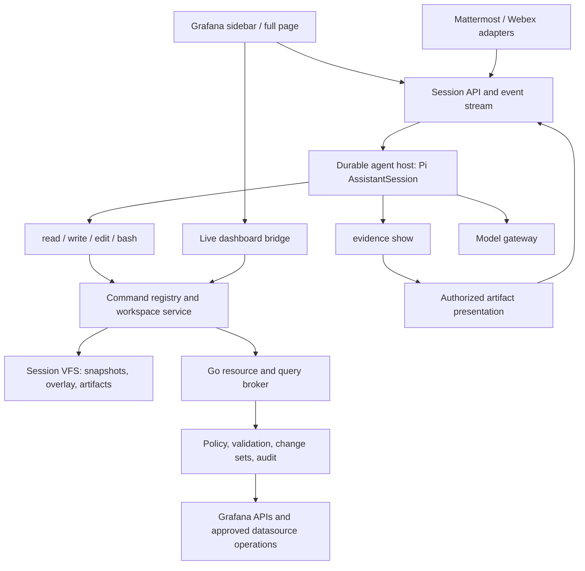

# Architecture review and roadmap

Review date: 2026-09-25, status updated 2026-09-29. Repository baseline of the
review: `4857f8c`, package version `4.0.0`. The review proposed a breaking
redesign; [Status](#status-2026-09-29) records what is implemented. The current
implementation is documented in [ARCHITECTURE.md](ARCHITECTURE.md).

## Status (2026-09-29)

This section is the current state. Everything from [Recommendation](#recommendation)
on is the original review (baseline `4857f8c`, 2026-09-25). It stays as the
design rationale, but three of its proposals were superseded:

- `workspace plan` and plan IDs: replaced by direct `workspace apply`. The user
  reviews the complete diff of the change set and can leave dashboards out;
  approval is bound to the change-set digest, and there is no stored plan.
- The `show_evidence` model tool: replaced by the `evidence show` shell command,
  which presents captured files without running queries again. The model-facing
  tools stay `read`, `write`, `edit`, and `bash`.
- The OpenClaw host pilot: the runtime stays Pi. The durable server host is an
  app-owned Node service running `AssistantSession`; OpenClaw contributes design
  patterns only (see the decision below).

### Implemented

- **M0, workspace removal:** the unused external workspace/VFS integration, its
  provider contract, the sample provider, and the launch wiring are deleted. The
  backend no longer saves dashboards with the service account, and `plugin.json`
  grants the service account only `users.permissions:read` for the app-access check.
- **M1, core and model budgets:**
  - Per-model `contextWindow` and `maxOutputTokens` flow through the settings UI,
    provisioning, the Pi importer, benchmark profiles, the frontend model, and
    the backend, which clamps request `maxTokens`.
  - Context compaction, first an own `transformContext` compactor, is now Pi
    Durable's background compaction (see the Pi Durable entry below). The chat
    shows a "Summarizing earlier conversation" run status and a transcript
    divider that expands to the summary. `npm run benchmark:compaction`
    measures summary fidelity (see [Evidence](#evidence-from-live-testing)).
  - One agent with a fixed tool set replaces the specialist subagents.
  - `AssistantSession` is the UI-independent session controller. It owns identity
    and title, launch context, model choice, the chat's harness and the system
    prompt of each turn, prompts and user shell commands, and the projected
    transcript and run state. Views attach as a `SessionHost` that supplies the
    environment (model stream, Grafana broker, skills, page context) and the
    chat log client. A test keeps React,
    Scenes, and `@grafana/runtime` out of its import graph. Page/sidebar handoffs
    re-attach the running session to the new view.
- **M2, four-tool shell:**
  - A persistent per-chat session filesystem used through `read`, `write`,
    `edit`, and `bash` (just-bash), with transactions and quotas.
  - Bash, jq (jq 1.8 as WebAssembly), and `python3` (CPython-WASM) run in
    terminable Web Workers; filesystem and command calls are mediated by the host.
  - A lazy dashboard catalog with coverage; skills (including `scripts/`),
    artifacts, receipts, and `/session/context.json` as read-only mounts.
  - Domain commands in modules: `grafana`, `grafana-prom` (with file/stdin
    batches), `grafana-dashboard`, `grafana-usage`, `grafana-alert`, `jsonnet`,
    `workspace`, `live`, and `evidence`.
  - Typed tools, the tool-name result renderers of retired tools, and runtime
    skill tool groups are removed.
  - Users can run commands in the same shell (`!command`), with history, Ctrl+R
    search, and Tab completion.
- **M3, dashboard change sets and validation:**
  - One dashboard walker (`workspace/dashboardPanels.ts`, ported from
    `grafana-inspect`) backs `inspect`, `queries`, `validate`, and `data`. `data`
    runs panel queries and applies transformations, overrides, and reducers with
    `@grafana/data`.
  - PromQL validation uses the upstream Prometheus parser in the backend
    (`/promql/parse`); `validate --server` adds a Grafana dry-run. v1 dry-runs do
    not validate the spec and v2 dry-runs miss dangling layout references, so the
    local structure checks stay.
  - `validate` and `fix` are separate; repairs are visible edits.
  - `workspace apply` writes as the current user with `resourceVersion`
    preconditions and bounded parallelism, keeps a per-operation journal
    (`applied`, `declined`, `conflicted`, `failed`, `unknown`, `not attempted`),
    and `workspace revert` stages the reverse of an apply for the same review.
    Mass edits across all visible dashboards go through one reviewed change set.
  - A dashboard Grafana cannot convert to the preferred API version is edited in
    its stored version, and `meta.json`, `grafana fetch`, and `inspect` report it.
  - The live dashboard is a file: `/live/dashboard/dashboard.json` (`GET_SPEC`)
    and `live diff|apply|discard|status` (`APPLY_SPEC`, with a spec-hash
    precondition against browser changes). `add-panel`, `set-panel`, and
    `label-filter` write schema-correct panels into working copies and the live file.
- **Pi Durable chats (2026-10-03):** every chat runs on a
  `@earendil-works/pi-durable` 1.0 harness in the browser (pi-ai 1.0). It
  replaces the `pi-agent-core` agent loop, the own compactor, the session
  snapshot store (Grafana user storage and PostgreSQL snapshots, no migration),
  and the save queue. Every step is committed to the chat's log in the plugin
  backend before it is shown (`pkg/chatlog`: embedded SQLite by default,
  PostgreSQL for HA), so a reload continues an interrupted answer, tools that may
  have written report an interruption instead of rerunning, opening a chat
  elsewhere takes it over with a fenced writer epoch, and summaries are written
  in the background. The session filesystem and the turn's prompt are durable
  documents. See [chat storage](docs/chat-storage.md).
- **Pi 0.87.1 and protocol parity (2026-09-29):** `pi-agent-core`/`pi-ai` are
  upgraded from 0.75.5. The backend speaks Pi 0.87's proxy protocol (system
  prompt and tools arrive as system messages with sections and tool deltas;
  `toolcall_end` carries the parsed call), and `llm_protocol_parity_test.go`
  covers Chat Completions/Responses translation: reasoning items and thinking
  formats, usage, tool-call IDs across protocol switches, parallel calls,
  cancellation, the `auto` fallback, upstream errors, and output clamping. The
  tests found and fixed three bugs: in-stream Chat Completions errors and
  truncated streams passed as normal replies, Responses `call|item` IDs leaked
  into Chat Completions history, and user cancellation was reported as a
  transport failure instead of `aborted`. `AssistantSession` tests cover
  streaming, tool round trips, cancellation mid-stream and mid-tool, and resume
  with a compaction summary; `llm_smoke_test.go` is an opt-in check against a
  real model server (`PI_LLM_SMOKE_URL`).
- **Alert rules as change sets (M5 subset, 2026-09-29):** every visible
  Grafana-managed rule is a working copy at
  `/grafana/alert-rules/<uid>/rule.json` (read-only `meta.json`, catalog
  `/grafana/catalog/alert-rules.ndjson`) through the App Platform AlertRule API.
  `grafana-alert validate` checks structure, the expression graph and
  condition, PromQL syntax with the upstream parser, contact point, time
  interval and routing references, and the datasource allow-list.
  `workspace status|diff|apply|revert|receipts` handle dashboards and rules in
  one change set; the review groups rules by folder and evaluation group.
  Creates and deletes work. Provisioned rules are read-only; writes keep the
  stored group and provenance; interval changes on grouped rules and moves
  between folders or groups are rejected, because Grafana's single-rule update
  would silently keep the group's interval. Grafana does not enforce
  `resourceVersion` for this API (legacy storage), so the broker re-reads each
  rule right before writing and reports `conflicted` if it moved; a write in
  between is not detected, which `meta.json` (`preconditions: client`) and the
  review state.

### Decisions taken since the review

- **No specialists or scoped delegation.** The specialist subagents looped on
  metric discovery and lost context at handoffs; in live tests the single agent
  with `read`/`write`/`edit`/`bash` completed tasks the specialists failed. Long
  tasks rely on one session plus compaction and on durable notes in
  `/session/findings.md`.
- **Jsonnet is a shell command** (`jsonnet`, backed by stateless `/jsonnet/eval`
  and `/jsonnet/fix`), and implicit save-time normalization became
  `grafana-dashboard fix`.
- **Skills are files** under `/.agents/skills`; skill tool groups no longer select tools.
- **`fd` was dropped** in favor of `find`. **jq is the real jq** (1.8 via
  `jq-wasm`): just-bash's reimplementation evaluated parenthesized assignment
  targets such as `(.a.b) = 5` to the value alone and silently corrupted files.
- **Typed file edits stay behind commands.** The local model broke large v2 JSON
  when hand-editing it, so `add-panel`, `set-panel`, and `label-filter` exist.
- **Local default model** is Ornith-1.5-35B-A3B (Q4_K_M). Ornith-1.5-9B gave
  comparable results in a spot check but was about 2.8x slower on the reference
  Strix Halo host (dense 9B vs. ~3B active parameters).
- **Pi only, no OpenClaw host.** The reviewed OpenClaw revision owns its agent
  core, so adopting it would replace the working Pi agent, compaction, and
  session model and require constraining a broad operator runtime to four tools.
  The server host runs `AssistantSession` with a server `SessionHost`. Channel
  adapters, the scheduler, and the delivery outbox borrow OpenClaw's gateway
  patterns (channel plugins, thread-keyed session routing, deterministic
  commands beside model tools, persisted jobs with run admission, a recovering
  delivery queue, one trust boundary per deployment); see
  [patterns borrowed from OpenClaw](docs/conversational-alerting.md#patterns-borrowed-from-openclaw).
- **Server-side enforcement waits for the server host.** Datasource queries run in
  the browser as the current user through Grafana's datasource API, so an
  allow-list check in the plugin backend would not constrain them, and the model
  cannot fabricate an approval because `workspace apply` is the only write path
  and the review is a trusted UI. Both become enforceable, and necessary, once
  runs continue without the browser (M4) and channels deliver approvals (M7).

### Evidence from live testing

- Sidebar variant, local model: multi-dashboard edits, new-dashboard creation,
  and a four-dashboard audit completed end to end.
- `workspace apply` conflicts are enforced by Grafana: 409 on stale
  `resourceVersion`, duplicate create, and delete preconditions.
- A forced 20k context window triggered elision and summarization, and the task
  finished with one panel dropped from the final table. This motivated the
  compaction fidelity benchmark (`npm run benchmark:compaction`): three seeded
  dashboards with unusual panel titles, two user-stated facts, turns about
  three other dashboards, and a final no-tools recall turn under a 20k window.
  It fails when nothing was summarized, when the recall turn uses tools, or
  when any fact is missing.
  First runs (2026-09-29, DeepSeek V4 Flash on the local DS4 server) found three
  compaction faults, now fixed: a turn that printed several large files
  summarized again on every step; output of one step larger than the history
  budget was kept verbatim, so truncation dropped the tool call and the model
  repeated the command; and summarizer requests were chunked by the agent's
  history budget instead of the window, so one summary took several model
  calls. Summaries now target about a quarter of the history budget. After the
  fixes, the benchmark passed with 14/14 facts recalled after two summaries
  (about 110 s per summary on that model).
- Production builds had broken `python3` (the AMD library wrapped the worker, and
  Grafana served the `.cjs` runtime as `text/plain`); both are fixed in
  `webpack.config.ts`. The demo datasources set `timeInterval: 60s` to match the
  seeded history, so `$__rate_interval` panels are no longer empty.

### Not yet implemented

- **Durable Pi server host (M4)** and the Mattermost host and identity spike
  (A0). Chats run in the browser on a Pi Durable harness whose state the backend
  stores: a run survives page/sidebar handoffs and continues when the chat is
  reopened after a reload, but makes no progress while no browser has it open.
  The same harness and extension can later run in a server host over the same
  storage contract.
- **Server-side policy:** the datasource allow-list and dashboard validation run
  in the browser, and approval is bound to the change-set digest but not to the
  actor or an expiry (see the decision above).
- **Rest of M5:** rule group operations (interval, reordering, moves), silences,
  contact points, notification policies, and mute timings.
- **Restricted MSSQL/Elasticsearch sources and the output policy (M6).**
- **Conversational alerting and channels (M7)**, including presentation events
  that channel adapters can render; `evidence show` renders only in the Grafana chat.
- **Release.** The redesign is on the `bash` branch and not yet released.

### Next steps

1. Run the compaction benchmark for each model profile in use on Pi Durable
   compaction and tune the thresholds in `durable/settings.ts` where recall drops.
2. Run the alert troubleshooting and dashboard benchmarks against the Pi 0.87
   build and the default local model, and add a benchmark for a model-driven
   alert rule edit through `workspace apply`.
3. Silences as reviewed changes (`grafana-alert silence`, expire), using the
   change-set review and operation journal, toward the companion plan's A2.
4. Build the Pi host and Mattermost identity spike (A0): a Node service running
   `AssistantSession` with a server `SessionHost` and broker-issued grants.
5. With the server host: a query broker that enforces the datasource allow-list,
   approvals bound to actor, change-set digest, and expiry, and the companion
   plan's A1–A4.

The follow-up [conversational alerting design](docs/conversational-alerting.md)
extends this roadmap with proactive Mattermost/Webex incident threads, screenshots,
silencing, and bounded follow-up on the Pi host.

## Recommendation

Center the agent on **`read`, `write`, `edit`, and `bash`**. Expose Grafana
capabilities as shell commands over a new session filesystem: discover resources,
inspect JSON, edit working copies, validate, and submit reviewed changes through
the backend. Add one narrow **`show_evidence`** tool for deliberate presentation
of selected query results, panels, and images to the user.

The existing external workspace/VFS integration in
`src/pages/Chat/agentWorkspace/` is unused and should be **deleted**, together with
its provider contract and workspace-specific launch wiring. Do not harden it,
preserve its protocol, or use it as the replacement's foundation. The new session
filesystem is a separate implementation for the Grafana agent. Keep just-bash as
the proposed shell engine; independently verify its commands and limits. The
installed version supplies `rg` and `jq`; `fd` needs an explicit implementation.

Use the same command services and presentation protocol for the Grafana sidebar,
full-page chat, and Mattermost/Webex conversations. Typed domain APIs remain
internal implementation boundaries rather than a large model-facing tool catalog.

The recommended order is:

1. Remove the unused workspace integration; define the four-tool, evidence, and resource authorization contracts.
2. Pilot the server host, extract the agent from React, and expose configurable model/context budgets.
3. Build the new session filesystem and migrate domain capabilities to shell commands.
4. Deliver deliberate evidence presentation, dashboard validation, and reviewed batch writes.
5. Add alert resources, restricted data access, and conversational incident operations.

Basic incident delivery can ship earlier through the companion plan's A0–A1:
it does not depend on completing dashboard batch writes. Host selection and
identity/policy boundaries belong in the first milestones.

Treat the requested SQL/log restriction as **schema and counts only: no raw
rows, log messages, or event contents reach the agent**. This applies to every
command and artifact, including dashboard validation and screenshots.

## Findings from the current implementation

Priorities below express implementation order and risk, not formal vulnerability
ratings. This was a source review with one isolated in-memory reproduction; it
was not a production penetration test or a live Grafana compatibility test.

| Priority | Finding and evidence                                                                                                                                                                                                                                                                                                                                                                                | Consequence and recommended change                                                                                                                                                                                                                              |
| -------- | --------------------------------------------------------------------------------------------------------------------------------------------------------------------------------------------------------------------------------------------------------------------------------------------------------------------------------------------------------------------------------------------------- | --------------------------------------------------------------------------------------------------------------------------------------------------------------------------------------------------------------------------------------------------------------- |
| P0       | [Dashboard saves](pkg/plugin/jsonnet_dashboards.go) call Grafana using `PluginAppClientSecret()`. [Route registration](pkg/plugin/resources.go) gates them with [app access](pkg/plugin/access.go), rather than an explicit caller check for the affected dashboard/folder. The [manifest](src/plugin.json) grants broad dashboard/folder service-account permissions.                              | App access and resource write permission are different decisions. Introduce a backend resource policy before expanding writes; require the caller's permission and the service credential's permission. Do not infer caller authority from the service account. |
| P0       | Write confirmation is a React callback in [ChatSceneObject.tsx](src/pages/Chat/ChatSceneObject.tsx).                                                                                                                                                                                                                                                                                                | Bind backend approval to exact changes, resource versions, actor, and expiry; reauthorize at commit. Shell commands must not be able to fabricate approval.                                                                                                     |
| P1       | [ChatSceneObject.tsx](src/pages/Chat/ChatSceneObject.tsx) is 4,146 lines and owns agent creation, tools, model selection, approvals, artifacts, persistence, navigation, and rendering. [chatRunRegistry.ts](src/pages/Chat/chatRunRegistry.ts) stores live `Agent` objects and UI callbacks in module memory.                                                                                      | Refresh/restart recovery and Webex cannot share this lifecycle. Extract a UI-independent session controller and then a durable server host.                                                                                                                     |
| P1       | [Tool selection](src/pages/Chat/ChatSceneObject.tsx) branches between the unused external workspace integration and the Grafana tool stack. Maintained Jsonnet files, artifacts, and live dashboard state have different lifecycles.                                                                                                                                                                | Delete the unused branch and provider integration. Build one new session filesystem for maintained resources, with live unsaved dashboard state as a distinct source.                                                                                           |
| P1       | [`model.ts`](src/pages/Chat/model.ts) hardcodes `contextWindow: 128000` and `maxTokens: 4096`. [Pi import](scripts/configure-pi-model.mjs) and [benchmark profiles](scripts/benchmarks/profile.mjs) discard model limit metadata. The agent construction has no context compaction hook.                                                                                                            | Preserve Pi limits through every configuration layer and implement budgeting/compaction. The 4,096 value is model metadata, not a demonstrated effective output cap: the Go proxy maps request `options.maxTokens`, which must also be set and bounded.         |
| P1       | [Metrics](src/pages/Chat/tools/metrics.ts) execute through the browser datasource service. [Errors](src/pages/Chat/tools/client.ts) can include backend error payloads. Existing raw/screenshot/artifact paths were not designed for a strict SQL/log content policy.                                                                                                                               | Restricted datasources require a server query broker and an output policy before any content enters shell memory, artifacts, transcripts, or model requests.                                                                                                    |
| P2       | [Dashboard validation](pkg/plugin/dashboard_validation.go) primarily normalizes classic panel IDs/layouts and produces quality warnings. Multiple readers implement their own dashboard structure handling; see [alert tools](src/pages/Chat/tools/alerts.ts), [dashboard context](src/pages/Chat/tools/dashboardContext.ts), and [metric context](src/pages/Chat/tools/dashboardMetricContext.ts). | Introduce one versioned dashboard model adapter and a layered validation service. Keep validation pure; make repairs explicit, reviewable edits.                                                                                                                |
| P2       | [ToolRenderer.tsx](src/pages/Chat/ToolRenderer.tsx) dispatches rich views by tool name; its Prometheus chart constructs a new `SceneQueryRunner`.                                                                                                                                                                                                                                                   | Extract reusable views behind explicit `show_evidence` presentation events. Render captured results by default; a display action must not silently execute another query.                                                                                       |
| P2       | [Specialist completion logic](src/pages/Chat/tools/subagentRunner.ts) nudges particular old tool sequences. Some benchmarks require exact specialist calls or tool names.                                                                                                                                                                                                                           | Evaluate observable outcomes, conflicts, privacy, and cost. Replace fixed specialist/tool choreography with a small common tool surface and optional scoped delegation.                                                                                         |

Keep the useful existing pieces: server-side secret handling; Grafana native
sidebar integration; typed live mutations; Go Jsonnet rendering; bounded metric
results; artifact references; context/launch integration; and the substantial
fixture and benchmark suite. Extract their implementations behind shared
interfaces instead of rewriting all domain logic at once.

Grafana's service-account documentation confirms that these credentials carry
the plugin's declared permissions and documents deployment limitations. Verify
the exact supported Grafana release before selecting delegated authentication
or multi-organization support. [Grafana service accounts](https://grafana.com/developers/plugin-tools/how-to-guides/app-plugins/use-a-service-account).

## Target architecture



### Runtime and deployment

Extract a TypeScript core with no imports from React, Scenes, `@grafana/runtime`,
browser storage, or `window`. Its dependencies should be injected interfaces:
`ModelGateway`, `WorkspaceStore`, `ResourceProvider`, `CommandRegistry`,
`SessionStore`, `ApprovalService`, `EvidencePresenter`, `EventSink`, and
`LiveDashboardBridge`.

The durable host is an app-owned Node service that runs `AssistantSession` on
`pi-agent-core` (decided 2026-09-29; OpenClaw is not adopted, see
[Status](#decisions-taken-since-the-review)). The restricted just-bash/VFS and Go
broker are shared with the browser host. The Go plugin remains
the Grafana-facing authentication, resource policy, and validation boundary.
Grafana, Mattermost, and Webex become session clients. Give the runtime
an authenticated, narrowly scoped broker connection; do not put Grafana service
credentials or provider keys into the shell environment. Propagate actor and
organization through a server-issued session grant, never a client-supplied UID.

This adds a deployed service and persistent storage. Make that an explicit
requirement of the new major deployment, with Compose/container packaging,
health/readiness checks, protocol compatibility, and upgrade instructions.
A temporary browser host can reuse the extracted core during migration; avoid
maintaining two different runtimes indefinitely. Do not assume Grafana will
launch a Node daemon just because the plugin ships a Go backend.

Continue with `pi-agent-core` in the browser until the host exists. Evaluate
`pi-coding-agent` session and compaction facilities in a bounded spike once the
host boundary exists. Adopt
them only with custom VFS tools, controlled storage, and ambient shell/filesystem,
extension discovery, and credential discovery disabled. Never expose the SDK's
default OS shell as the workspace shell. Keep Pi behind an adapter so adopting
its session facilities does not define the public session protocol.

The [companion design](docs/conversational-alerting.md#patterns-borrowed-from-openclaw)
lists the OpenClaw gateway patterns the host borrows and the
[host guardrails](docs/conversational-alerting.md#host-guardrails) it must meet.

The current Go backend also maintains its own Chat Completions/Responses request
and streaming translation in `resources.go` and `openai_responses.go`. Keep that
working gateway during extraction. In M4, evaluate moving protocol translation
to `pi-ai` provider adapters inside the trusted Node host, which would reduce
duplicate SDK maintenance and make additional providers easier. Keep credentials
in the trusted gateway host, inaccessible to VFS/commands, and retain central
model authorization. Switch only after parity tests for reasoning items, usage,
tool-call IDs, cancellation, and retries; avoid maintaining two competing protocol
implementations after cutover.

At review time the app pinned Pi **0.75.5** against a reviewed checkout of
**0.87.1** (`5fd446ca1`). The upgrade to 0.87.1 landed on 2026-09-29 with
stream, cancellation, tool, reasoning, and resume tests (see [Status](#implemented)).

### Suggested code ownership

These are responsibility boundaries; do not create packages simply to reproduce
this directory sketch.

| Area                      | Responsibility                                                                             |
| ------------------------- | ------------------------------------------------------------------------------------------ |
| `packages/agent-core/`    | Session orchestration, Pi adapter, context budget, events, command contracts               |
| `packages/workspace/`     | Paths, mounts, snapshots, overlays, transactions, search, artifact storage                 |
| `packages/grafana-model/` | Versioned dashboard/alert identities and pure inspection functions                         |
| `packages/evidence/`      | Artifact contracts, provenance, presentation events, reusable view models                  |
| `packages/commands/`      | Shell argument parsing and typed command handlers; generated help                          |
| `services/agent-runtime/` | Node host, durable sessions, worker isolation, queues, model gateway adapter               |
| `src/pages/Chat/`         | Grafana UI, approval/diff presentation, live dashboard bridge                              |
| `pkg/plugin/`             | HTTP adapters, caller authorization, resource/query broker, validation and commit services |
| `services/channels/`      | Mattermost/Webex adapters, identity binding, incident delivery                             |

These are proposed boundaries; begin with modules and promote them to packages
when they need separate builds. Retain webpack for the plugin and mage for Go.
Generate shared wire types from versioned schemas and check Go/TypeScript
conformance rather than duplicating configuration normalization by hand.

## Workspace and shell design

### Mount contract

This describes the new Grafana session filesystem, independent of the unused
external workspace implementation scheduled for removal.

```text
/grafana/catalog/dashboards.ndjson             # paginated discovery snapshot
/grafana/dashboards/<uid>/dashboard.json        # remote snapshot + local overlay
/grafana/alert-rules/<uid>/rule.json            # remote snapshot + local overlay
/grafana/alert-groups/<uid>/group.json           # group/evaluation relationships
/grafana/alerting/notification-policy.json      # separate config capability
/grafana/datasources/<uid>/metadata.json        # approved metadata only
/grafana/datasources/<uid>/schema/...           # SQL/log schema projections
/live/dashboard/dashboard.json                # current unsaved browser document
/workspace/...                                # scratch, authored JSON/Jsonnet
/artifacts/<id>/...                            # bounded, policy-filtered evidence
/schemas/<kind>/<version>/...                  # read-only validation schemas
/skills/...                                   # read-only instructions/resources
/session/plan.md                               # durable task plan
/session/findings.md                           # durable evidence summary
/tmp/...                                      # temporary files, with a quota
```

The authenticated session selects the Grafana instance and organization. Paths
do not select another tenant. Use stable UIDs as identities, expose titles and
folders in the catalog, and avoid writable title-based aliases. Do not mount
Grafana provisioning directories, host files, secrets, or arbitrary server config.

Mounted resource files are local working copies. Redirection, `write`, `edit`,
and `rm` never immediately change Grafana. A separate change set applies selected
resource changes; unrelated scratch changes are excluded.

Each resource needs metadata outside its editable document: provider, resource
kind, UID, namespace/org, source API/version, server revision, fetch time,
provenance, permitted operations, schema version, redaction policy, and content
hash. Provider-owned fields cannot be changed by editing a JSON file. Preserve
unknown plugin fields and resource versions when round-tripping JSON. Convert
classic/v1/v2 deliberately, report loss, and never silently flatten native tabs.

Redacted config needs patch semantics: omitted secrets mean unchanged, not
delete. Do not perform full replacements of redacted resources. Limit the first
alert configuration release to enumerated non-secret fields; credentials and
receiver secrets remain outside the workspace.

### Discovery and scale

Use paginated metadata discovery and lazy content loading. Loading a directory
must not eagerly download every dashboard. Cache by organization, principal,
resource revision, and policy version; invalidate permission changes and deny
access to cached artifacts when authorization expires.

Make search scope explicit. `rg` searches the hydrated working set. A separate
`grafana search` performs bounded remote corpus discovery, returning coverage,
continuation cursor, fetched resource count, and truncation. Never report “no
matches” as a complete corpus search when only some resources were loaded.
Index derived panel/query/metric relationships once per resource revision and
reuse them across search and validation.

### Command surface

The default model-facing inventory is `read`, `write`, `edit`, `bash`, plus
`show_evidence`. The file tools share the shell's session filesystem and mutation
policy. Read supports bounded ranges; edit uses exact-match/revision checks and
reports ambiguity; write stages a local file. Keep familiar coding-agent semantics
and clear errors so the model can recover using the same tools.

Discovery, queries, validation, Jsonnet rendering, resource changes, incident
actions, and bounded watch creation are commands invoked through `bash`. Do not
add a parallel model tool for every command or a separate commit tool.
`workspace plan` creates an immutable plan and emits a system review event;
`workspace apply <plan-id>` uses the backend's authorization and approval state.
Waiting for approval must release the execution worker and survive reconnect.
Approval callbacks belong to the authenticated UI/channel, outside model tools.

Generate shell `--help`, argument schemas, examples, and effect declarations from
one registry. Keep semantic operations typed behind that registry. Shell syntax
is an interface, not the authorization mechanism. Allow capabilities by command
implementation and broker operation, never by a regex over the shell text.

| Command family                                           | Proposed purpose                                                    |
| -------------------------------------------------------- | ------------------------------------------------------------------- |
| `rg`, `fd`, `jq`, `cat`, `diff`, `sort`, `head`          | Local file discovery, filtering, and transformation                 |
| `grafana search`, `grafana fetch`, `grafana refresh`     | Explicit bounded resource hydration and revision refresh            |
| `grafana-dashboard inspect/convert/validate/query-check` | Dashboard structure, format conversion, schema and query validation |
| `grafana-dashboard data-check`                           | Approved, bounded runtime query validation                          |
| `grafana-dashboard render`                               | Optional Jsonnet generation into the working copy                   |
| `grafana-alert inspect/validate`                         | Rule structure, group links, expression and config checks           |
| `grafana-prom query`, `grafana-prom metrics`             | Existing Prometheus capabilities behind the query broker            |
| `grafana-sql schema/count`, `grafana-logs schema/count`  | Restricted metadata and aggregation operations                      |
| `workspace status/diff/validate/plan`                    | Inspect changes and create an immutable commit plan                 |
| `workspace apply <plan-id>`                              | Request execution of the approved plan through the broker           |

These names are proposed, not existing commands. Implement `fd` as a documented
subset or a vetted compatible implementation; do not assume it ships with
just-bash. Specify supported `rg` and `jq` behavior and maintain compatibility
fixtures. Decide whether the existing `jq-wasm` or just-bash jq implementation
is canonical after checking representative scripts; avoid two subtly different
JSON languages exposed through separate tools.

For example, after hydrating selected dashboards:

```bash
fd -e json /grafana/dashboards
rg -l 'http_requests_total' /grafana/dashboards
jq '.spec.title = "Checkout reliability"' /grafana/dashboards/checkout/dashboard.json > /tmp/dashboard.json
mv /tmp/dashboard.json /grafana/dashboards/checkout/dashboard.json
grafana-dashboard validate /grafana/dashboards/checkout/dashboard.json --format json
workspace diff
workspace plan --path /grafana/dashboards/checkout/dashboard.json
```

The example assumes a v2 resource and a future implementation supporting atomic
file replacement. Plan creation produces a reviewable plan ID; applying it
requires the corresponding authorization/approval.

Commands produce JSON/NDJSON on stdout, concise diagnostics on stderr, and
documented exit codes. Include `schemaVersion`, coverage/truncation, and artifact
references in structured results. Store large allowed outputs once and return
paths plus short summaries. Avoid silently truncated JSON.

### Deliberate evidence presentation

`show_evidence` is a presentation tool, with no query execution or resource-write
capability. Shell commands first produce bounded, policy-filtered artifacts; the
agent inspects them with `read`/`bash` and chooses which results support its answer.
Most commands need only the generic execution view: command, status, stdout,
stderr, and exit code. Avoid rebuilding the old per-tool render dispatch around
shell command names or parsing stdout into implicit UI instructions.

A proposed call references immutable artifact IDs returned by the broker:

```json
{
  "title": "Checkout error rate",
  "items": [
    { "artifactId": "ev_query_17", "view": "timeseries", "caption": "Last 30 minutes" },
    { "artifactId": "ev_panel_18", "view": "panel" }
  ]
}
```

Support a small versioned set of views: query with execution metadata, timeseries,
bounded table, captured panel, and image. Extract useful existing Scenes/data-frame
components, using a snapshot data provider rather than an automatic query runner.
Panels must use approved snapshot data and vetted visualization types or a safe
image; an arbitrary dashboard JSON document must not trigger datasource requests.
Show the executed query where policy permits, absolute time range, capture time,
resource revision, source, and coverage. Mark empty, partial, stale, or failed
results visibly. An unexecuted query draft must be labeled as a draft and cannot
be presented as measured evidence. Start the first release with executed artifacts.

The presenter resolves each artifact through a trusted catalog and checks current
principal, tenant, source policy, and destination audience. Editable filesystem
copies do not confer provenance. Do not accept arbitrary HTML, executable chart
specifications, external image URLs, or raw model-supplied results as verified
evidence. Prometheus results may support charts/tables; Elasticsearch and MSSQL
remain restricted to approved schema/count artifacts. Apply the same restriction
to query text, labels, captions, links, and image pixels.

Presentation displays the captured result without another query. An explicit
refresh command creates a new artifact and presentation revision. Optional
Explore/dashboard links are labeled as navigation to a live view; they do not
replace the evidence snapshot or bypass the recipient's access checks.

Persist ordered presentation events with artifact references, bounded card/series/
row counts, and idempotency keys. Return a compact presentation receipt to the
agent. Replaying a session must not rerun queries or duplicate channel attachments.
The same event becomes an interactive Grafana view or Mattermost/Webex text,
image, and links through the channel adapter. Destination binding comes from the
authenticated conversation; the tool cannot send evidence to arbitrary rooms.

Keep approval diffs, pending actions, permission errors, commit receipts, and
required incident notifications as automatic system events. The agent's decision
to present evidence must not control whether these essential states are visible.

### Filesystem and execution invariants

- One persistent VFS per session; all mutation entry points use the same policy.
  Separate canonical resource snapshots from editable overlays and scratch files.
  Specify that shell variables, functions, and working directory reset per
  invocation unless explicitly supplied; filesystem persistence does not imply
  an interactive terminal or a persistent shell process.
- One shell invocation gets a transaction over local changes. Validate paths,
  permissions, file counts, per-file bytes, aggregate bytes, and revision
  preconditions before committing it. On abort, timeout, or failed staging,
  discard that invocation's resource changes. Document this transactional
  behavior because ordinary bash can leave changes after a failed command.
- Define rename/replacement and deletion explicitly. Deleting a scratch file
  removes it; deleting a mounted resource creates a reviewable tombstone when
  the capability permits deletion. Reject unsupported operations before mutation.
- Normalize paths centrally; reject traversal and ambiguous encodings, and
  initially disable symlinks/hard links across mounts. Enforce read-only status
  during execution and resource hydration, not only during save.
- Enforce output limits as UTF-8 bytes. Bound total workspace growth and output
  while executing, not only after a large result has been allocated.
- Run shell execution in a terminable worker/process with CPU, wall-time, memory,
  file-count, and output limits. A timer/AbortSignal on the same browser
  thread is cooperative; it is not a hard execution limit.
- No host filesystem mounts, ambient environment, generic network commands,
  package installation, or arbitrary process execution. Custom commands receive
  only their typed broker capability and sanitized results. Propagate cancellation
  and deadlines to each broker request.

The upstream project documents a TypeScript virtual shell, custom commands, and
browser support; API details differ by release. Pin and test the chosen version,
especially filesystem and cancellation semantics. [just-bash documentation](https://github.com/vercel-labs/just-bash/blob/main/packages/just-bash/README.md).

## Writes, batch operations, and live edits

Introduce one change-set lifecycle:

```text
snapshot -> stage -> validate -> freeze plan -> review/approve -> commit -> reconcile
                                   |                           |
                                edit again                  conflict/partial
                                   |                           |
                               new plan                    explicit recovery
```

A frozen plan contains resource identities, operations, base revisions, before
and after hashes, validation reports, affected folders/groups, policy version,
and a cryptographic digest. Do not use the VFS's FNV checksum as an approval
integrity token. Approval binds to the plan digest, actor, scope, and expiry and
is recorded by a trusted UI or preconfigured server policy. The model cannot
manufacture approval by writing a file or passing `approved: true`.

At commit the server checks the caller, current policy, resource ownership,
provisioning provenance, current revisions, plan integrity, and approval again.
Use the actual API's conditional update mechanism (`resourceVersion`, version,
or equivalent). A preflight GET alone leaves a race; an adapter without a safe
conditional update must disclose or disable that operation. Do not default to
unconditional overwrite. Permissions are required per target and destination
folder, including moves, creates, and deletes.

Separate local batch atomicity from remote batch persistence. Local multi-file
editing can be atomic; assume Grafana has no transaction across arbitrary
dashboards and alert resources. Validate and authorize all targets first, then
apply with bounded concurrency, dependency ordering, an idempotency key, and a
per-resource operation journal. On timeout, read back before retrying. Report
`applied`, `failed`, `conflicted`, `unknown`, and `not attempted` explicitly.
Offer compensation from saved before-images only if the current revision still
matches our write; never overwrite an intervening user's change to “roll back.”

For alert groups, preserve evaluation interval, ordering/group membership,
provenance, notification references, and expression dependencies. Choose the
proper transaction unit per API; updating one group must not accidentally replace
siblings omitted from the working set. Contact points, notification policy trees,
mute timings, rule groups, and individual rules need distinct adapters and
capabilities. A redacted resource is not a lossless replacement document.

Live editing remains a separate target exposed by a browser bridge. Bind each
operation to the expected dashboard UID and live revision, discover commands
from the current Grafana runtime, and mark results as **unsaved**. Never replace
the dirty browser document with a saved API snapshot. If the bridge disconnects,
return unavailable or stage a proposed durable change; do not silently save it.
Webex can prepare durable plans but cannot assume an active dashboard scene.

The local Grafana implementation confirms that the restricted mutation API is
backed by the currently mounted document and discovers commands dynamically:
`public/app/features/plugins/components/restrictedGrafanaApis/dashboardMutation/`
and `public/app/features/dashboard-scene/mutation-api/`.

## Validation and reuse from chezmoi

The reference implementation is documented at
`/var/home/gordon/.local/share/chezmoi/docs/grafana-tools.md`. It is useful source
material, but its CLI credentials, filesystem access, process spawning, and
upstream checkout bootstrapping must be replaced with app-owned interfaces.

| Existing component                                                    | Reuse                                                                      | Integration decision                                                                                                                                       |
| --------------------------------------------------------------------- | -------------------------------------------------------------------------- | ---------------------------------------------------------------------------------------------------------------------------------------------------------- |
| `tools/grafana-dashboard/convert.go`, `context.go`                    | Upstream classic/v1/v2 conversion and conversion context                   | Extract Go library functions behind the dashboard adapter; preserve source format/provenance and report conversion loss.                                   |
| `tools/grafana-dashboard/validate.go`, `schema.go`, `audit.go`        | Upstream v2 Go/CUE validation and integrity checks                         | Add a backend validation service with structured diagnostics. Pin schemas to supported Grafana versions.                                                   |
| `tools/grafana-dashboard/promql.go`                                   | Upstream Prometheus parser                                                 | Share a bounded syntax validation service with query-check commands. Parsing is separate from metric existence or runtime correctness.                     |
| `tools/grafana-dashboard/render.go`                                   | Jsonnet patch workflow                                                     | Merge useful behavior with existing Go Jsonnet support; keep JSON editing a first-class path.                                                              |
| `tools/grafana-inspect/dashboard_visible_data.ts`                     | Panel/query extraction, interpolation, transformations, reducers           | Extract pure functions. Replace HTTP/auth with the query broker and enforce restricted-source policy before querying.                                      |
| `tools/grafana-inspect/query_check.ts`                                | Per-panel diagnostics, hidden targets, inactive tabs, unresolved variables | Reuse its traversal and report shape; replace `spawnSync` with the typed parser service.                                                                   |
| `tools/grafana-inspect/dashboard_editor_diagnostics.ts` and harnesses | Actual upstream editor/schema behavior                                     | Keep as optional CI or separately packaged validation worker initially. Do not bootstrap a Grafana checkout and install dependencies during an agent turn. |
| `scripts/grafana/alerts.py`                                           | Alert conversions and API behavior                                         | Port the needed logic into versioned alert providers; test grouped operations against the deployed Grafana release.                                        |
| `tools/grafana-version.json`, `tools/update-grafana.mjs`              | Coordinated upstream version pins and checks                               | Adopt a compatibility manifest linking Grafana frontend packages, Go dashboard modules, schemas, and test fixtures.                                        |

The chezmoi Node tools currently pin Grafana **13.2.2**; the app uses **13.2.1**.
The local Grafana checkout is `2cf60b2a9c1`. Record these separately and test the
deployed version instead of assuming checkout HEAD matches the plugin runtime.
The chezmoi documentation reports a grouped alert creation limitation in its
tested App Platform API path; preserve a provisioning adapter where needed and
verify that behavior in integration tests before expanding alert writes.

Validation should return independent results for:

1. JSON parsing, envelope, path, size, and identity checks.
2. Version-specific schema and reference integrity.
3. Query syntax, datasource resolution, and variable interpolation.
4. Policy, permission, provenance, and data-access constraints.
5. Optional server dry-run for the exact API operation, when supported.
6. Bounded approved data checks, with explicit empty/error/unsupported states.
7. UI rendering/interaction checks where a browser bridge is available.

Expose which levels ran. Schema validity does not establish panel correctness;
successful frame processing does not establish visual correctness. A count-only
datasource may permit syntax checks but forbid executing the original dashboard
query. Report that case as skipped by policy, not passed.

Split `validate` from `fix`. The present auto-normalization/repair behavior must
become explicit workspace edits visible in a diff, with revalidation afterward.

## Larger model contexts and Pi configuration

Make model limits an early, independently deliverable change. Editing Pi's
configuration alone currently cannot affect the app's hardcoded model metadata.

Define one model configuration schema with:

- Provider/model identity, protocol, capabilities, and supported thinking levels.
- `contextWindow`: the configured endpoint/model input-plus-output capacity.
- `maxTokens`: Pi's model output limit; preserve its meaning during import.
- `defaultMaxOutputTokens`: request budget, bounded by the configured output limit.
- Optional context policy: compaction threshold, recent-history budget, response
  reserve, tool-result reserve, and overall request byte ceiling.
- Non-secret provider compatibility options, separate from centrally stored keys.

Carry these through `src/types.ts`, `model.ts`, AppConfig, Go `modelSettings`,
provisioning, `configure-pi-model.mjs`, benchmark profile/config preparation, and
export/import. Support Pi's resolved model metadata and `modelOverrides` rather
than only hand-selecting fields from a custom model entry. Reject unsupported
provider settings with a clear explanation. Do not copy arbitrary Pi credential
commands or provider headers into client-visible settings.

Resolve and clamp limits on the server. Set request output options explicitly:
the existing proxy maps `options.maxTokens` into Chat Completions `max_tokens`
or Responses `max_output_tokens`. Treat protocol-specific compatibility as
tested configuration. Increasing model metadata cannot raise the provider's
actual capacity, and context size is not a request to generate that many tokens.
Use verified metadata for the selected OpenAI model/endpoint rather than a
blanket “OpenAI context size.” No provider-specific maximum is assumed here.

Budget the full request: instructions, tool schemas, history, tool results,
reasoning/provider overhead where applicable, and response reserve. Use provider
usage when available and a conservative estimate before sending. Compact before
overflow; preserve recent tool-call/result pairs, the user's constraints, pending
plan IDs, resource revisions, and artifact references. Keep workspace contents
outside the transcript and retrieve selected portions as needed.

Pi's local `packages/coding-agent/src/core/compaction/compaction.ts` and
`settings-manager.ts` are useful references, but this app uses `Agent`, not an
`AgentSession`; CLI compaction settings are not automatically inherited. Preserve
an uncompacted event history separately from model context. Rebudget when the
user switches to a smaller model and compact without dropping pending approvals.

Acceptance: an imported model with a synthetic 256k window survives the full
configuration round trip; mocked near-limit turns compact correctly; configured
output limits reach both proxy protocols; real calls use only a model/endpoint
whose advertised capacity has been verified. Benchmark context utilization,
latency, output truncation, task success, and model switches.

## Restricted MSSQL and log access

### Policy boundary

Define capabilities independently of source visibility:
`schema.read`, `aggregate.count`, `resource.read`, `resource.stage`, and
`resource.commit`. For each datasource specify allowed schemas/tables/fields,
approved dimensions, permitted predicates, time range, bucket size, execution
timeout, concurrency, and output limits. Empty or unknown policy must deny
restricted operations.

Restricted data is filtered before reaching the runtime. Apply this to direct
queries, lazy VFS reads, variable discovery, annotations, alert previews, panel
inspection, mixed-datasource dashboards, screenshots, errors, artifacts,
telemetry, persisted sessions, and channel responses. Imported sessions and
resource hydration cannot be an alternate raw-data ingestion path.

Dashboard/alert JSON itself can contain embedded sample data, SQL literals,
annotation text, or static text panels with event content. For strict restricted
workspaces, either provide an approved projection with patch-only write semantics
or deny the resource when it cannot be safely represented. Do not promise the
restriction merely because live queries are filtered.

### MSSQL

Expose typed operations such as:

```text
grafana-sql schema --datasource orders --table dbo.Orders
grafana-sql count --datasource orders --table dbo.Orders --window last-24h
```

The server resolves table identifiers against an allow-list and compiles a small
query AST with parameterized values. The initial product has no arbitrary
`rawSql` command. Permit counts and optionally approved time/dimension buckets;
omit row samples, arbitrary expressions, free-text grouping, value enumeration,
joins, subqueries, user-defined functions, dynamic SQL, and cross-database access.
Do not derive permission from “starts with SELECT” or a regex blacklist.

Schema exploration returns approved names, types, nullability, and relationships;
exclude default expressions, comments, computed definitions, and examples unless
explicitly vetted. The query response must match an aggregate-only schema before
it leaves the broker. Unexpected columns, exemplars, or upstream error details
are rejected/redacted. Distinguish an exact count from a metadata-based estimate,
and attach its time window and freshness.

Use a dedicated database principal with minimum metadata/query rights. For a
strong source-level guarantee, query curated aggregate views or stored procedures
and deny base-table reads. A read-only account can still read every allowed row.
Grafana explicitly warns that its MSSQL datasource does not validate query safety,
so the app needs its own boundary. [Grafana MSSQL configuration](https://grafana.com/docs/grafana/latest/datasources/mssql/configure/).

### Elasticsearch logs

Elasticsearch is the logging target. Expose `grafana-logs schema/count` through
an Elasticsearch broker adapter, scoped to approved Grafana datasource UIDs and
index aliases/data streams. Resolve targets on the server; reject arbitrary index
patterns, system indices, and cross-cluster targets unless explicitly authorized.
Check resolved backing-index scope as aliases and data streams change.

For schema exploration, project approved field names, types, and
searchable/aggregatable capabilities from `_field_caps` and, where needed, mappings.
Do not return document samples, mapping `_meta`, script definitions, or arbitrary
mapping content. Report incompatible field types across backing indices rather
than guessing a common schema. [Elasticsearch field capabilities](https://www.elastic.co/docs/api/doc/elasticsearch/operation/operation-field-caps).

Compile typed filter requests into server-owned Query DSL. Use `_count` for
document counts and a tightly restricted `_search` with `size: 0` for approved
time-bucket counts. Fix the permitted timestamp field and operational filter
fields in datasource policy. The agent receives neither arbitrary Query DSL nor
Lucene query-string, SQL, or ES|QL execution. [Count API](https://www.elastic.co/docs/api/doc/elasticsearch/operation/operation-count),
[aggregation requests](https://www.elastic.co/docs/explore-analyze/query-filter/aggregations).

Reject document retrieval, `_source`, hit fields, highlights, `inner_hits`,
`top_hits`, `top_metrics`, suggestions, scripts/runtime mappings, and predicates
over message/event text. `size: 0` alone is insufficient: nested aggregations can
still expose content. Validate the complete request tree and emit only a typed
count/bucket response; never forward the raw Elasticsearch response or errors.
Grouping is allowed only on explicitly approved operational dimensions, including
their permitted values. A `keyword` field can still contain full message contents.

Require bounded windows, minimum bucket sizes, maximum buckets, query deadlines,
and concurrency limits. Inspect shard failures, timeouts, early termination, and
any count relation/error metadata; incomplete results must not be labeled exact
or interpreted as recovery. Use document counts rather than substituting field
`value_count`, which has different semantics. Index read credentials are not
count-only credentials: keep them in the broker, restrict their scope, and consider
separate aggregate-only indices for a stronger source-level boundary.

Counts can disclose information through repeated predicates or tiny groups.
Start with fixed approved filters/dimensions and rate limits; add minimum cohort
sizes or coarser buckets where required. Exact unrestricted counting cannot
guarantee that underlying values are uninferable. Describe this limit explicitly
instead of equating aggregate-only output with a formal privacy guarantee.

Acceptance tests must attempt indirect disclosure through grouping, errors,
dashboard variables, mixed panels, screenshots, saved artifacts, and channel
replies. The pass condition is that disallowed bytes never enter the agent
workspace/model request, not that the assistant declines to quote them afterward.

## Durable sessions, incident operations, and chat channels

The [conversational alerting design](docs/conversational-alerting.md) is the detailed
plan for this workstream. Keep incident state, delivery receipts, silence actions,
and expiring watch grants outside the agent transcript. Deliver deterministic
alerts before optional model enrichment, reconcile source state while silenced,
and apply the restricted-data policy to screenshots and notification annotations.
Mattermost is the first channel adapter on the Pi host; Webex follows against
the same channel interface.

Persist session metadata, ordered events, workspace checkpoints, model/context
state, pending approvals, operation journal, and artifact references. Keep large
blobs separate from event records. Define retention, per-session storage quotas,
ownership, deletion, and permission rechecks for restored sessions.

Serialize turns per session and use leases/fencing to prevent two workers owning
one run. Support reconnect/replay from an event sequence, cancellation, and
bounded queues. Checkpoint around tool operations; restarting must not replay
a write blindly. Store request and commit IDs so an interrupted write can be
reconciled before the model continues. Sidebars should reconnect to the same
server run rather than transfer an `Agent` object between React components.

Both platforms should use adapters against this session API. For Webex:

- Verify webhook signatures against the raw request body using the documented
  Webex contract for the configured webhook type. Reject unverified ingress.
  [Webex webhook guide](https://developer.webex.com/messaging/docs/api/guides/webhooks).
- Deduplicate event/message IDs, suppress bot echoes, enqueue work quickly, and
  retry outbound delivery through an outbox. Treat duplicate delivery as normal.
- Bind verified Webex identities to explicit Grafana principals/organizations;
  a display name or email string supplied by the message is insufficient.
- Scope conversations by organization, room/thread, and authorization context.
  A room audience must be allowed to see the response; sender access alone is
  insufficient. Begin with linked users in direct conversations or vetted rooms.
- Begin with read-only analysis and links to Grafana for detailed review and
  approval. Later interactive approvals must be actor-bound, expiring, replay-safe,
  and tied to the exact change-set digest.
- Publish only policy-filtered summaries and authorized links. Do not forward
  arbitrary transcript/artifact blobs or credentials into a chat room.

The public webhook receiver is an independently secured ingress to the service;
do not assume an unauthenticated third party can call Grafana's user-authenticated
plugin resource routes. A bot identity and a Grafana user identity remain separate.

## Delivery roadmap

Each milestone has a demonstrable exit condition. This ordering allows a useful
Grafana release before enabling alert mutations, restricted sources, or Webex.
No calendar estimates are assigned without a team/deployment decision.

| Milestone                                           | Deliverable                                                                                                                                                           | Exit condition / required evidence                                                                                                                                                                                                        | Dependencies                                                    |
| --------------------------------------------------- | --------------------------------------------------------------------------------------------------------------------------------------------------------------------- | ----------------------------------------------------------------------------------------------------------------------------------------------------------------------------------------------------------------------------------------- | --------------------------------------------------------------- |
| M0 — Remove unused integration and define contracts | Delete external workspace/VFS integration and provider contract; define four tools plus evidence, resource capabilities, caller authorization; Pi host/identity spike | No unused workspace launch/provider branch remains. Backend writes enforce caller authority. A0 proves the host exposes exactly the intended tools with broker-issued identity.                                                           | None                                                            |
| M1 — Extract core and model budgets                 | Session controller outside React; injected adapters; model configuration round trip; bounded context/output handling                                                  | Maintained sidebar/full-page flows run through the core. Model limits propagate through provisioning, importer, backend, and benchmarks.                                                                                                  | M0 contracts                                                    |
| M2 — Four-tool shell and evidence                   | New persistent filesystem; lazy dashboard catalog; shared artifacts/skills; `rg`/`jq` and documented `fd`; command registry/help; worker limits; `show_evidence`      | Multi-dashboard tasks use read/write/edit/bash. Selected artifacts render in chat without query reexecution. Search reports coverage; cancellation and quotas bound staging. Working files and artifact references restore with sessions. | M1                                                              |
| M3 — Dashboard change sets and validation           | Extracted chezmoi validators; JSON and optional Jsonnet commands; immutable plans; conditional writes; batch journal; live bridge                                     | Review/apply a 20-dashboard fixture batch through shell commands and system approvals. Inject conflicts, permission changes, timeouts, and partial failure; verify no lost concurrent edits.                                              | M0, M2                                                          |
| M4 — Durable service host                           | Pi host service running `AssistantSession`; authenticated Go broker; persistent state; reconnect and operation recovery                                               | Runs survive closing Grafana and worker restart. Approvals bind exact plans; writes and evidence delivery reconcile without duplicates. Host parity/isolation gates pass.                                                                 | M1 and A0; M2–M3 for command/presentation parity                |
| M5 — Alerting resources                             | Rule/group/config files and commands; redacted patch model; API adapters and provenance policy                                                                        | Stage validated edits, review configuration changes, preserve sibling rules and secret fields. Provisioned/managed resources reject unauthorized mutation.                                                                                | M3                                                              |
| M6 — Restricted sources                             | Server-generated MSSQL/Elasticsearch schema/count commands and output-policy enforcement                                                                              | Raw content cannot enter shell outputs, artifacts, model requests, screenshots, presentations, or errors. Count and coverage semantics remain visible.                                                                                    | M0 policy, M2, M4 broker                                        |
| M7 — Conversational alerting and channels           | Mattermost/Webex adapters; incident journal/outbox; selected evidence; silence/expire commands; bounded watches; identity/audience enforcement                        | Initial alerts survive model failure; duplicate events/clicks are safe; silences reconcile; restricted content is excluded; watches expire and recover.                                                                                   | M4 and audience/action policy; A0–A4 allow incremental delivery |
| M8 — Complete cutover                               | Remove remaining old domain tools, tool-name render dispatch, and duplicate stores; deployment packaging and session export/migration                                 | Supported workflows use the four generic tools and explicit evidence presentation; no dependence on retired tool names. Maintained chat content has a defined export/migration path.                                                      | M3–M7 for enabled release scope                                 |

M5 can proceed after M3 while the durable host is completed. M6 policy design
should begin in M0 so new validation/data commands cannot accidentally establish
a raw-data escape route. Webex ingress work can start once the session protocol
is stable, but production rollout depends on M4 and audience authorization.
For early alert delivery and silencing, follow companion milestones A0–A4;
silencing is a separate operational capability and need not wait for all M5
rule-definition/config editing. M4's runtime choice is gated by the A0 host pilot.

### First implementation slices

1. Remove the unused `agentWorkspace` integration, contract/sample endpoints,
   and workspace-only launch/benchmark wiring; retain normal dashboard/sidebar context.
2. Prove the new tool surface with a vertical slice: discover/fetch two dashboards,
   use `rg`/`fd`/`jq`, edit JSON, validate, and present one captured query or panel
   via `show_evidence`. Use a new filesystem implementation with checked mutations.
3. Run the Pi host and Mattermost identity spike; expose model/context/output
   configuration end to end, including benchmark profiles.
4. Extract `AgentSessionController`, working-file persistence, and presentation
   events from ChatSceneObject; share the command and artifact services across hosts.
5. Ship a single-resource reviewed commit through `workspace plan/apply`, then
   add batch commit and migrate the remaining domain tools into commands.

### Delete or replace during the breaking cutover

| Current mechanism                                                                | Replacement                                                                                          |
| -------------------------------------------------------------------------------- | ---------------------------------------------------------------------------------------------------- |
| Unused external workspace/VFS integration and provider contract                  | Delete without protocol replacement or compatibility adapter; build a new Grafana session filesystem |
| `write_jsonnet`, `read_jsonnet`, `edit_jsonnet`, `fix_jsonnet` as separate tools | Generic file operations plus optional Jsonnet render/fix commands                                    |
| Mandatory `write_dashboard_plan` tool sequence                                   | Task plan file and backend-generated immutable commit plans                                          |
| Per-panel/per-field model-facing mutation tools                                  | Typed domain services exposed as bash commands                                                       |
| Tool-name-specific custom result renderers                                       | Generic execution view plus explicit `show_evidence` and reusable artifact views                     |
| Fixed specialist tool names and completion nudges                                | Optional scoped delegation with isolated overlays and explicit merge                                 |
| Separate artifact jq tool and filesystem JSON filtering                          | One tested JSON filter implementation over artifact files                                            |
| Mutable global tool-name approval classification                                 | Session capability registry and backend effect enforcement                                           |
| UI-owned sessions and in-memory-only live run registry                           | Durable session service and event replay                                                             |
| Automatic repair hidden inside validation/save                                   | Explicit staged fixes and a reviewed diff                                                            |
| Hand-maintained duplicated Go/TypeScript wire configuration                      | Versioned schema with generated types and conformance checks                                         |

Delete the unused Coding Agent App Contract integration, including
`src/pages/Chat/agentWorkspace/`, `docs/coding-agent-app-contract.md`, the sample
provider endpoints, workspace-specific launch handling, and associated fixtures/
benchmarks. Trace references when implementing removal; preserve unrelated sidebar
and dashboard launch support. No successor external-provider contract or migration
of unused workspace overlays is required.

Old tool compatibility is unnecessary. Preserve/export maintained chat history,
user-authored Jsonnet, and allowed artifacts through a deliberate cutover path.
Do not migrate pending approvals or raw restricted artifacts as trusted state.

## Verification and operating criteria

Keep current seeded fixtures and benchmark infrastructure. Rewrite brittle
exact-tool-call expectations around outcomes, resource effects, and budgets.
Measure command/API count, bytes hydrated, context utilization, time to first
useful result, task completion, cancellation latency, and peak workspace memory.
Use finite limits for child agents as well as shell loops and the main agent.

Required release gates:

- Contract tests shared across browser/server hosts and all resource adapters.
- VFS traversal, read-only, symlink, delete/rename, Unicode byte-limit, quota,
  transaction, resource hydration, and restart recovery tests.
- Shell script fixtures for the supported `rg`, `fd`, `jq`, pipe, and redirection
  subset; malicious/unbounded loops terminate within the worker limit.
- Per-resource authorization across users, folders, orgs, service accounts,
  cached reads, and expired approvals; edited plans invalidate approval.
- Grafana compatibility fixtures for classic/v2 dashboards, native tabs, unknown
  panel fields, provisioned resources, alert groups, and dirty live dashboards.
- Batch partial-failure and concurrent-edit tests, including unknown outcomes
  after timeout and idempotent reconciliation after worker death.
- Restricted-source tests across every output path, with sentinel raw values
  that must never appear in model requests, VFS files, errors, or channel output.
- Evidence presentation from immutable artifacts: no hidden query reexecution,
  forged provenance, arbitrary destinations, or duplicated cards on replay. Empty,
  partial, stale, and revoked-access results render correctly across clients.
- Session identity and Webex audience isolation; duplicate ingress/outbox delivery.

Emit structured audit events for resource reads, query capabilities, plan approval,
commit/reconciliation, policy denial, and model usage. Record identifiers and
bounded diagnostics, avoiding raw query results, credentials, and sensitive
resource content. Pin policy/schema/adapter versions in events to explain behavior
after upgrades. Reuse existing telemetry without unbounded metric labels such as
raw session IDs or resource contents.

## Review evidence and unresolved decisions

Source inspection covered the main React/Pi runtime, tool registry, shell/VFS,
provider client, Go access/save/model routes, session storage, current validation,
model import, and benchmark profile generation. One temporary Node process
transpiled the VFS module in memory and reproduced the unchecked overlay behavior;
it did not write files or call Grafana. That integration is unused and slated for
deletion; the observation is not a requirement to repair or preserve it. Inspection
also confirmed tool-name dispatch and query execution in the current chart renderer.
No application code was changed and no
live model, dashboard write, or full test suite was run for this review.

Local references inspected:

- Pi: `/var/home/gordon/repos/github.com/earendil-works/pi`, especially model
  types, model configuration docs, settings, and compaction implementation.
- Grafana: `/var/home/gordon/repos/github.com/grafana/grafana`, especially restricted
  mutation API source, dashboard schemas, and alert resource provenance validators.
- chezmoi: `/var/home/gordon/.local/share/chezmoi`, especially the Grafana tool docs,
  Go conversion/validation CLI, and Node inspection/query-check implementation.
- Installed Pi 0.75.5 and just-bash 3.0.2 package code/types, to distinguish the
  app's dependencies from newer reference checkouts and upstream documentation.

Decisions to settle in M0/M1, with recommended defaults already used above:

| Decision                                                 | Recommended default                                                                                                                    |
| -------------------------------------------------------- | -------------------------------------------------------------------------------------------------------------------------------------- |
| Is an additional runtime service acceptable?             | Yes. An app-owned Pi host service; the broker/incident state remain app-owned.                                                         |
| Whose permissions govern writes?                         | Explicit mapped caller permissions intersected with broker policy and credential scope. No caller mapping means no writes.             |
| Are counts allowed to expose arbitrary dimension values? | No. Approved dimensions/predicates only; no free-text grouping or value exploration.                                                   |
| What does alerting “config” include first?               | Non-secret rule/group fields, notification policy, and mute timing structures behind separate capabilities. Credential edits excluded. |
| Can source-managed dashboards/rules be edited?           | Read-only by default; stage proposals for the owning source workflow where possible.                                                   |
| Which agent runtime should own server conversations?     | Pi (decided 2026-09-29). OpenClaw's gateway patterns inform the host design; it is not adopted as a runtime or dependency.             |
| What happens to existing sessions?                       | Versioned export and selective one-way migration of allowed content; fresh approvals and fresh permission checks.                      |
