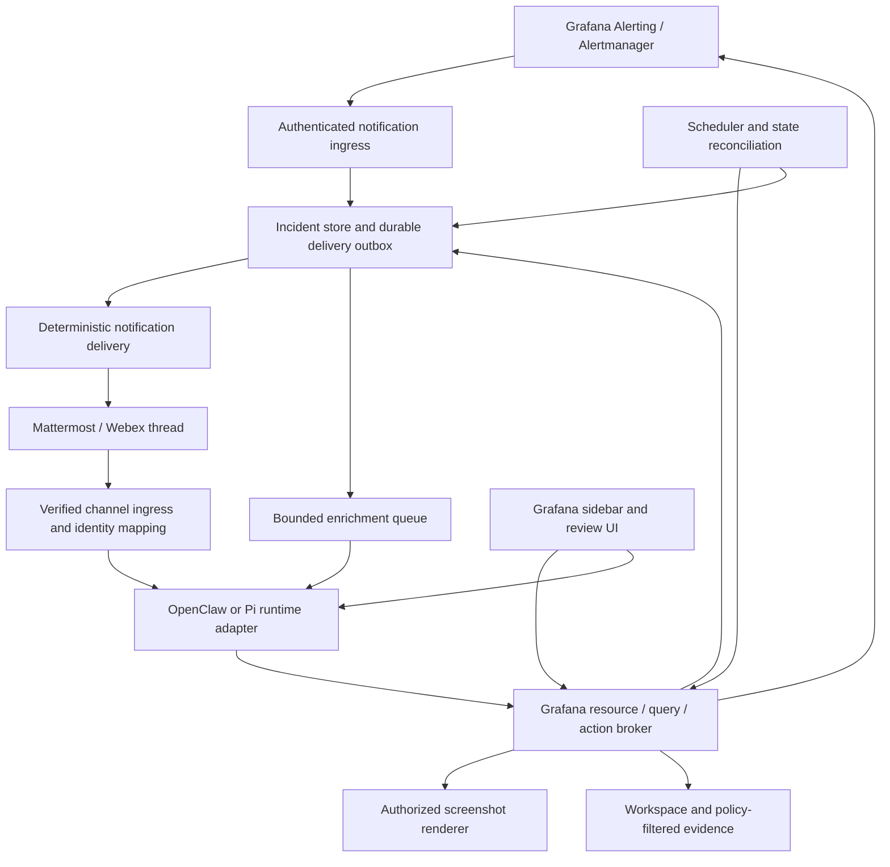

# Conversational alerting, Mattermost/Webex, and OpenClaw

Reviewed 2026-09-25. This extends [the architecture roadmap](../ROADMAP.md).
It proposes a product and implementation direction; no integrations were enabled,
messages sent, or alerting configuration changed during this review.

## Recommendation

Build an **incident assistant around Grafana Alerting**: reliable alert delivery,
an ongoing conversation for each incident, evidence and screenshots, authorized
silencing, and scheduled follow-up. Preserve Grafana/Alertmanager as the authority
for alert evaluation, notification routing, and silences. Maintain explicit
incident state, delivery state, and automation grants outside the LLM transcript.

Pilot **OpenClaw as the server conversation/automation host with a Grafana domain
plugin**, starting with Mattermost. Keep the Grafana resource/query broker,
new restricted session filesystem, validation, and action authorization independent
of that host.
Make the host decision before building the bespoke durable runtime in roadmap M4.
The existing browser Pi runtime can remain during the pilot.

Drop the unused external workspace/VFS integration and its provider contract.
The replacement exposes `read`, `write`, `edit`, and `bash`, with Grafana/incident
operations implemented as shell commands. Add only `show_evidence` for deliberate
rich presentation of captured query/panel artifacts. This is the same tool
surface in Grafana and channel conversations; no external-workspace compatibility
layer is part of the host pilot.

For an operations team sharing an explicitly defined trust domain, OpenClaw is a
strong candidate: it already has Mattermost, persistent conversations, scheduling,
proactive delivery, and extension APIs. For Grafana users with substantially
different data permissions, adopting one shared gateway needs additional isolation
or separate gateways. Do not equate channel routing with access isolation.

**The Pi assumption has changed in the available source.** The local OpenClaw
checkout, version `2026.9.5` at `2d84bb11af0`, owns its agent implementation in
`packages/agent-core`, `src/agents`, and `src/llm`. Its external Pi dependency is
`@earendil-works/pi-tui` 0.85.1. The runtime ID alias `pi` now resolves to
`openclaw`. Sharing ancestry does not provide runtime or session compatibility
with this app's Pi 0.75.5. The current upstream documentation confirms these
boundaries. [OpenClaw runtime architecture](https://docs.openclaw.ai/agent-runtime-architecture).

## What the experience should support

An example incident thread, with illustrative values:

```text
Assistant: Checkout error-rate alert is firing in production.
           First observed 14:02 UTC; 3 instances; observed value 8.4%.
           [Investigate] [Show panel] [Acknowledge] [Silence options]

Operator: Compare with the previous hour and check the related latency panels.
Assistant: Error rate increased at 14:01; latency increased two minutes later.
           Here are the selected panels and query evidence. The cause is unconfirmed.

Operator: Silence only checkout in eu-west for 30 minutes, and keep watching it.
Assistant: Proposed silence: Grafana Alertmanager, this rule, checkout, eu-west.
           Currently matches 3 instances. Ends 14:38 UTC.
           Monitoring continues; notifications matching the silence are suppressed.
           [Confirm this silence] [Cancel]

Assistant: Silence created. I will check every 5 minutes for the next 30 minutes,
           report recovery here, and stop after the final check.

Operator: Give me a fresh screenshot and stop the periodic updates.
Assistant: [timestamped screenshot] Periodic updates stopped. Silence still ends
           at 14:38 UTC. [Expire silence now]
```

The initial alert, its delivery, and the actual silence result must remain useful
when the model or image renderer is unavailable. Natural-language requests select
workflows; deterministic services own their effects.

| Experience                   | Added behavior                                                                                 | Source of truth                                      |
| ---------------------------- | ---------------------------------------------------------------------------------------------- | ---------------------------------------------------- |
| Alert thread                 | Deduplicated root notification, firing/resolved updates, related evidence                      | Alertmanager state plus incident store               |
| Conversational investigation | Questions, bounded metrics/count queries, comparisons, runbook references, follow-up questions | Broker results and cited artifacts                   |
| Screenshots                  | Alert-time image, refreshed panel, selected related panels, explicit variables/time range      | Render service and artifact metadata                 |
| Acknowledge/assign           | Named responder and handoff notes                                                              | Incident store, or a chosen external incident system |
| Silence/expire               | Preview exact matchers/duration, apply, inspect, end early                                     | Selected Alertmanager                                |
| Watch/recheck                | “Check in 10 minutes”, “watch for 30 minutes”, “tell me when recovered”                        | Structured, expiring automation                      |
| Proactive briefings          | Shift handover, active incidents, recurring noise reports                                      | Approved schedule and scoped evidence                |
| Rule/dashboard improvements  | Propose threshold, query, layout, or runbook edits and review them                             | Planned shell commands and reviewed change sets      |

Grafana already supports silences and screenshots in supported notification
setups. The expansion is the persistent conversation, richer investigation,
delivery options, and controlled follow-up around those features.

## System design and ownership



Separate these owners even if some run in the same process:

- **Grafana/Alertmanager:** rule evaluation and health, active instances,
  notification grouping/inhibition, silence state, and durable rule/config writes.
- **Incident service:** source event journal, episode identity, current observed
  state, acknowledgement, thread bindings, action receipts, and reconciliation.
- **Agent host:** model turns, conversation history, context compaction, tool
  execution orchestration, and human-facing progress.
- **Broker:** effective permissions, schema/count restrictions, rendering policy,
  immutable action plans, and Grafana API operations.
- **Channel adapter:** verified sender/message identities, platform formatting,
  media upload, reply/thread addressing, interaction callbacks, and delivery receipts.
- **Scheduler:** bounded follow-up jobs and renewal/cancellation. Choose one owner
  per job; adopting OpenClaw must not leave a second independent timer executing it.

Use a versioned host adapter such as `startTurn`, `cancelTurn`, `getTranscript`,
`deliver`, and `scheduleCheck`; these are proposed app interfaces, not claims
about existing OpenClaw APIs. Keep runtime-specific IDs behind the adapter and
map them to app session/incident IDs.

### An incident is more than a conversation

Store at least:

```text
Incident
  id, grafanaInstanceId, orgId, alertmanagerId, routingPolicyId
  alertInstances[] { fingerprint, startsAt, ruleUid?, labelsProjection, observedState }
  groupKey, episode, receivedAt, lastReconciledAt, evidenceFreshness
  sourceStatus, responderStatus, notificationStatus
  acknowledgement { actor, timestamp, comment }?
  deliveries[] { channelAccount, room, rootMessage, thread, audiencePolicy, receipt }
  evidence[] { artifactId, resourceRevision, timeRange, policyVersion }
  actions[] { planId, actor, receipt, resultingSilenceId? }
  watches[] { jobId, ownerGrant, expiry, predicate, cadence, destination }
```

Keep source state (`firing`, `resolved`, `unknown/stale`), responder state
(`unacknowledged`, `acknowledged`, `closed`), and notification suppression separate.
An acknowledgement does not silence anything; a silence does not resolve anything;
a conversation can close while the source remains firing. Missing data or loss of
access is not recovery.

Scope an alert instance by instance/org/Alertmanager/fingerprint and firing episode
(`startsAt` plus reconciliation as needed). Scope group keys by receiver/routing
policy; group membership changes over time. Store per-alert status even when the
notification group reports `firing`. A repeated delivery updates the existing
episode; a later recurrence can start a linked episode. Correlation across rules
is initially a suggestion and must not merge away independent alert lifecycles.

One incident can have multiple delivery records with different audience policies.
Do not merge private DM transcripts into a public incident thread. Cross-channel
handoff publishes an approved summary and evidence references.

## Notification ingestion and reliability

Use a Grafana webhook contact point targeting the incident ingress. Configure
authentication, body-size limits, and preferably Grafana HMAC with its optional
signed timestamp; verify the raw request before parsing. Bind its credential to
an instance/org/receiver policy rather than trusting payload `orgId` or URLs.
The standard payload includes per-alert fingerprints/status, group keys, related
URLs, and a truncation count. [Grafana webhook contract](https://grafana.com/docs/grafana/latest/alerting/configure-notifications/manage-contact-points/integrations/webhook-notifier/).

The ingestion sequence should be:

1. Authenticate and validate the event; project permitted labels, annotations,
   and values before storing agent-visible content. Alert text may itself contain
   raw logs/rows, secrets, or instructions from untrusted sources.
2. Durably record the event and enqueue a basic notification, then acknowledge
   HTTP delivery. Do not wait for an agent turn, a screenshot, or channel posting.
3. Resolve/create the incident episode and its channel root. Persist the platform
   message ID and delivery receipt. Send a concise deterministic alert first.
4. Coalesce enrichment work per incident revision. The agent adds a bounded
   evidence-backed update, with source timestamps and uncertainty.
5. Reconcile with source APIs on relevant transitions and a bounded interval.
   Record degraded/unknown state if source access fails.

At-least-once processing is the practical target. Distinguish transport retries
from legitimate repeat reminders; a fingerprint alone cannot identify a message.
Deduplicate identical event/state revisions while retaining changed values and
repeats required by the notification policy. Handle delayed resolved events and
out-of-order firing events with source state reconciliation. A truncated group or
an alert absent from a webhook is not evidence that the alert resolved.

Coalesce alert storms before model calls, limit per-team model/render budgets,
cancel obsolete enrichment, and prevent late work for an old revision from
overwriting the latest status. Persist failed/unknown delivery for retry or review.
Channel transport idempotency varies; do not promise exactly-once messages after
an ambiguous remote timeout. Preserve an incident marker to aid reconciliation.

Keep a native Grafana contact-point fallback during rollout. Start with a separate
test destination to avoid double-paging. Production routing must explicitly choose
primary, fallback, and escalation behavior; neither the LLM nor a generic heartbeat
decides whether a critical initial alert is delivered. Monitor the bridge from an
independent path so failure of the bridge can itself be reported.

## Screenshots as evidence and channel attachments

There are two complementary image paths:

1. **Grafana notification capture:** reuse a permitted alert-linked capture when
   available. Grafana's webhook integration references externally stored images;
   it does not upload local image bytes. This path has datasource/Alertmanager and
   renderer restrictions. [Grafana image notifications](https://grafana.com/docs/grafana/latest/alerting/configure-notifications/template-notifications/images-in-notifications/).
2. **Broker rendering:** render an authorized dashboard/panel on demand or during
   enrichment, then upload the resulting artifact through the channel API. This
   also supports related panels and refreshed evidence after the initial alert.

The app's existing `renderDashboardScreenshot` in
[`tools/dashboards.ts`](../src/pages/Chat/tools/dashboards.ts) uses browser globals,
the current browser session, and `/render/d[-solo]/...`. Extract the operation
behind a server render service; reusing the frontend function cannot power an
unattended alert. Keep live unsaved-dashboard rendering a distinct browser feature.

Each image records instance/org, dashboard UID and revision, panel identity,
selected variables, absolute time range, timezone, dimensions, capture time,
and applicable policy. Distinguish a capture taken during firing from a later
render of historical data: dashboard changes and data retention can change what
the latter shows. Include accessible text and Grafana links with every image.

Render from broker-resolved resource IDs; do not follow arbitrary notification
`panelURL`, `imageURL`, or runbook URLs with privileged credentials. Allow-list
origins, restrict redirects, and prevent cross-tenant media cache reuse. Use fixed
presets for dimensions, query range, concurrency, and timeout. Rendering failure
adds a diagnostic to the thread and never blocks the alert.

Screenshots must honor the schema/count-only policy. A log/table panel, annotation,
tooltip, text panel, label, or variable can reveal prohibited content. Prefer
approved panel types/dashboards or a purpose-built incident dashboard containing
only allowed aggregate evidence. If the content cannot be validated, deny the
image and provide allowed counts and links. Image redaction after rendering is
not the primary enforcement boundary. Do not forward alert-captured images without
checking the same audience/content policy.

The logging source is Elasticsearch. Incident investigation and scheduled watches
use the broker's approved field metadata and document/time-bucket counts. They
must not retrieve document hits, `_source`, highlighted snippets, or representative
events through dashboard queries or aggregation subrequests. Apply the same policy
to Elasticsearch-derived alert annotations before model input or channel delivery;
an alert payload can already contain prohibited event content. Failed or partial
shard results mean incomplete evidence, not recovery. See the
[Elasticsearch access design](../ROADMAP.md#elasticsearch-logs).

Uploading an image copies its contents into Mattermost/Webex retention and access
controls. An expiring Grafana URL does not expire an uploaded platform copy.
Keep image delivery and model vision input separate: a text-only model can request
and deliver a screenshot using structured query evidence, without receiving its
pixels. Both uses require explicit content policy.

## Silencing and other incident actions

Grafana silences suppress notifications for a time window without stopping rule
evaluation, and apply to a specific Alertmanager. Mute timings are recurring
notification-policy controls. [Grafana silence semantics](https://grafana.com/docs/grafana/latest/alerting/configure-notifications/create-silence/).

| User request           | Effect                                                  | Initial policy                                                                            |
| ---------------------- | ------------------------------------------------------- | ----------------------------------------------------------------------------------------- |
| “Acknowledge this”     | Record responder ownership in the incident system       | Authorized responder; audit actor and timestamp                                           |
| “Stop your updates”    | Cancel a watch or snooze this bot's updates             | Owner/team-scoped operation; no Grafana suppression                                       |
| “Silence this for 30m” | Create a bounded silence on the identified Alertmanager | Exact target/matcher plan, current permission, explicit approval or narrow existing grant |
| “Unsilence this”       | Expire the identified silence early                     | Preview the affected scope, check current permission, journal result                      |
| “Mute every night”     | Change recurring notification policy/mute timings       | Higher-impact configuration change-set workflow                                           |
| “Pause the rule”       | Change evaluation behavior                              | Separate capability and approval; never inferred from “silence”                           |
| “Raise the threshold”  | Change rule definition                                  | Validated rule change set with visible before/after                                       |

Proposed shell/API commands:

```text
grafana-alert instances --incident INC-42
grafana-alert silence plan --incident INC-42 --duration 30m --scope selected-instances
workspace apply <approved-action-plan-id>
grafana-alert silence inspect <silence-id>
grafana-alert silence expire-plan <silence-id>
incident acknowledge INC-42
incident watch plan INC-42 --every 5m --for 30m --on recovery
```

A silence plan binds instance/org/Alertmanager, exact matchers and their operators,
rule identity where supported, absolute start/end, reason, actor, incident ID,
and the observed affected set. Prefer positive equality matchers over broad regex
or negative matchers. Matchers can affect future instances too: the current match
count is a preview, not a permanent bound. Reject empty/general scope unless the
caller has a separately authorized policy for it. Do not create a silence from
`commonLabels` alone without establishing the intended scope.

Enforce maximum duration and approved label/rule scope server-side. Broader or
regex silences require broader authority. Re-evaluate scope and current permissions
at apply time; if approval is stale, expiry passed, or affected scope materially
changed, refresh the plan. Record the returned silence ID, re-read to verify, and
report the exact end time. An HTTP admission response alone is not a verified effect.

Use the broker's operation ledger for duplicate clicks and retries. A timed-out
create is an unknown outcome; search/reconcile using the operation identity and
recorded target before creating another silence. Do not blindly retry creates
or claim atomic conditional updates if that Alertmanager API lacks them. Serialize
app-owned changes and detect concurrent changes where possible; document the
remaining race for APIs without compare-and-swap semantics.

The local Grafana source has specific silence authorization in
`pkg/services/ngalert/accesscontrol/silences.go`. Its built-in routes include
`/api/alertmanager/grafana/api/v2/silences` for create/update and
`/api/alertmanager/grafana/api/v2/silence/{SilenceId}` for lookup/expiration.
External Alertmanagers have separate datasource routes. Implement versioned
adapters; do not treat dashboard-write permission as silence permission, and do
not use the notification's `silenceURL` as an API authorization token.

**Silencing creates a notification-observation gap.** A silenced alert may produce
no recovery webhook. Watches must reconcile current alert/rule state through
approved APIs. Mark polling failures stale, not resolved. Honor notification
suppression for new unsolicited messages; continue an explicitly requested watch
only within its independent grant. A silence expiring is not evidence of recurrence,
and cancellation of a watch must not accidentally cancel the silence.

## OpenClaw-style conversation and autonomy

Support direct conversations and incident threads, with mention-based activation
outside threads the assistant owns. Within an incident thread, follow-up questions
should reuse the task state and evidence without requiring a new command every time.
Show short progress, permit correction/steering, and make stop/cancel effective
across queries, rendering, model turns, and pending scheduled work.

Add controlled memory in three scopes:

- **Incident:** evidence, timeline, hypotheses, actions taken, pending work.
- **Team:** curated runbooks, service ownership, approved dashboard mappings,
  notification destinations, and explicit operating preferences.
- **User:** private preferences and personal task state, excluded from team output
  unless deliberately shared.

Distinguish observed facts from generated hypotheses. Treat annotations, runbooks,
messages, and VFS content as data that cannot grant new permissions. A prompt file
such as `AGENTS.md` can explain an approved program; it cannot authorize a silence,
expand datasource access, or make a private transcript public.

“Keep an eye on it” should become a reviewable structured watch, including its
target, evidence query, interval, end time, maximum runs/cost, recovery predicate,
destination, actor/grant, and stop conditions. Ask only for missing material scope;
use visible team defaults for routine values. After acceptance, the agent can run
the checks and report within that grant without asking permission on every tick.

Use deterministic scheduling and evidence predicates for promised rechecks,
silence-expiry notices, and escalation timers. Model calls explain changes or
investigate within budgets. A generic heartbeat is suitable for optional briefings,
not an exact operational deadline or the sole critical alert detector.

Schedules retain explicit delegated authority after a chat disconnects, with
current-policy checks at execution. Cap and expire that authority; revoke it when
the user/team mapping or destination permission is removed. Stop on expiry,
requested cancellation, sustained recovery, exhausted budget, or revoked access.
Do not convert “watch this” into permanent autonomous monitoring.

Additional programs can correlate several alert groups, flag a sustained aggregate
trend, or produce a handover even when no rule fires. Record these as
`agent-observation` or `scheduled-review` events with their evidence and confidence;
do not present them as Grafana firing alerts. Promote a useful persistent condition
into a reviewed Grafana rule where it can be evaluated deterministically. Any
autonomous notification program still needs an approved audience, query scope,
cadence, budget, and escalation policy.

## Mattermost and Webex implementation

| Capability                            | Mattermost                                                                           | Webex                                                                    |
| ------------------------------------- | ------------------------------------------------------------------------------------ | ------------------------------------------------------------------------ |
| Conversation ingress                  | Bot account, REST APIs, authenticated WebSocket post events                          | Verified message webhooks, then authenticated resource retrieval         |
| Incident thread                       | Root post plus replies; persist root ID                                              | Parent message/thread addressing, verified for the deployed client/API   |
| Interaction                           | Native interactive posts/buttons/dialogs or slash commands                           | Adaptive Cards and attachment-action webhooks                            |
| Screenshots                           | Upload permitted image and post attachment in the thread                             | File attachment or supported image presentation, with text fallback      |
| OpenClaw support at reviewed revision | Implemented plugin and local source available                                        | No Webex channel implementation/manifest found in the inspected checkout |
| Work still needed                     | Grafana identity mapping, domain actions, audience policy, reliable incident binding | Those same controls plus a channel adapter or separate bridge            |

### Mattermost

Reuse `extensions/mattermost` and the documented SDK rather than copying its
WebSocket/reconnect/routing implementation into the Grafana app. The local plugin
has thread routing, media delivery, identity normalization, and interaction code.
Set incident conversations to thread mode explicitly; the documented default
does not create a thread for every top-level post. [OpenClaw Mattermost](https://docs.openclaw.ai/channels/mattermost).

An important limitation: the reviewed OpenClaw presentation path renders value
buttons as messages to the agent; command/callback/approval actions are not
equivalent executable buttons. Use these buttons for “Investigate” or choosing
options. Implement a Grafana action callback/command that verifies sender and
immutable plan ID for “Confirm silence”, or link to the Grafana review UI.
Do not interpret arbitrary text “yes” as authority for whichever action is pending.

Mattermost's platform supports interactive integration callbacks independently of
OpenClaw's abstraction. A domain interaction endpoint can therefore be added
without changing the agent loop. Check deployed-server support before choosing
the newer presentation format. [Mattermost interactive messages](https://developers.mattermost.com/integrate/plugins/interactive-messages/).

Bind authenticated platform user IDs to Grafana principals; mutable usernames
are display data. Callback context must be unforgeable and bound to the action,
message, room, and expiry; authenticate the platform callback and check that the
actual clicker is permitted. The bot's channel membership is not a user's Grafana
authorization. Test duplicate clicks, forwarding, deleted posts, and removed users.

### Webex

Implement a channel plugin against the same incident/host contract if OpenClaw
is chosen. Verify webhook signatures, retrieve messages/attachment actions with
the configured bot credentials, deduplicate IDs, ignore the bot's own messages,
and bind platform person/room IDs to trusted app identities.

Webex action notifications require a separate authenticated fetch to obtain the
submitted fields. Include accessible fallback text. Its documented card limitations
also restrict editing cards that contain images, so keep an updatable text/action
card separate from screenshot messages. [Webex Buttons and Cards](https://developer.webex.com/messaging/docs/buttons-and-cards).

Version a channel-neutral `IncidentPresentation` containing text, facts, evidence
references, and action IDs. Render it differently per platform. An action ID refers
to backend state; it must not contain credentials or editable raw API arguments.
Disable/expire stale actions server-side even when a platform cannot update the
old card. A reply should describe the committed result and link to its receipt.

### Deliberate evidence in conversations

Use the roadmap's [`show_evidence` contract](../ROADMAP.md#deliberate-evidence-presentation)
for agent-selected query results, panels, and images. For example, the agent can
run `grafana-prom query`, inspect its captured artifact, then call `show_evidence`
to attach the relevant chart to the incident discussion. This separates a shell
command's execution log from the evidence the responder should see.

Share artifact references and view definitions with `IncidentPresentation`.
Grafana can render a captured data frame interactively; Mattermost/Webex receive
approved text, static images, and links. The delivery adapter enforces the current
thread and audience, deduplicates presentation events, and returns a receipt.
Rendering must not rerun the query, fetch arbitrary image URLs, or execute a
panel's embedded queries. Explicit refresh creates new timestamped evidence.

Initial alerts, firing/resolved transitions, approval requests, action outcomes,
and watch expiry remain deterministic system presentations. They must be visible
even if the agent never calls `show_evidence` or its model provider fails. Agent
captions are commentary, distinct from captured values and authoritative state.
Restricted Elasticsearch/MSSQL evidence contains only approved schema/count
results, including safe labels and pixels; channel presentation is not a separate
raw-content access path.

## OpenClaw integration options

| Option                                                        | What it buys                                                                        | Main cost/risk                                                                                    | Assessment                                                                  |
| ------------------------------------------------------------- | ----------------------------------------------------------------------------------- | ------------------------------------------------------------------------------------------------- | --------------------------------------------------------------------------- |
| Keep Pi; implement channels and scheduling in the app service | Full control of identity, VFS, and deployment                                       | Own every channel adapter, reconnect/replay path, schedule, outbox, memory, and model integration | Good fallback when the trust model or dependency surface rules out OpenClaw |
| OpenClaw host plus Grafana domain plugin                      | Existing Mattermost, sessions, scheduling, interaction, and provider infrastructure | Must constrain capabilities, integrate broker identity, and validate runtime recovery             | Recommended pilot and likely target for one trusted operations domain       |
| OpenClaw channels with a custom Pi harness                    | Preserve Pi orchestration while reusing OpenClaw's host features                    | Two runtime contracts and overlapping session/context ownership                                   | Use only if a concrete Pi requirement survives the host pilot               |
| Fork/embed OpenClaw internals in the Grafana plugin           | Maximum short-term customization                                                    | Coupled upgrades, broad runtime surface, complex packaging                                        | Avoid; use a deployed gateway and documented extension APIs                 |

### What the source actually provides

| OpenClaw source                                                                                         | Relevant evidence                                                            | What the app still owns                                                                    |
| ------------------------------------------------------------------------------------------------------- | ---------------------------------------------------------------------------- | ------------------------------------------------------------------------------------------ |
| `docs/agent-runtime-architecture.md`, `src/agents/runtime/index.ts`, `packages/agent-core/package.json` | OpenClaw-owned agent core and model runtime                                  | Migration/parity decision; no assumed Pi session compatibility                             |
| `extensions/mattermost/src/channel.ts`, `session-route.ts`, `mattermost/ingress-identity.ts`            | Channel tools, threaded addressing, stable authenticated sender IDs          | Grafana principal mapping and per-action authorization                                     |
| `docs/plugins/sdk-overview/tools-and-commands.md`                                                       | `registerTool` and deterministic `registerCommand` APIs                      | Restricted shell/domain tool implementation and action receipts                            |
| `docs/plugins/sdk-agent-harness/registration.md`, `core-ownership.md`                                   | Custom harness API; host prepares models, budgets, tools, and transcripts    | Proof that a Pi harness honors every tool restriction and lifecycle contract               |
| `docs/automation/cron-jobs/how-it-works.md`, `webhooks.md`                                              | Persisted schedules, background tasks, authenticated hooks and run admission | Incident reconciliation, bounded grants, and notification semantics                        |
| `src/infra/outbound/delivery-queue-storage.ts`, `delivery-queue-recovery.ts`                            | Durable delivery machinery                                                   | Platform receipt mapping and ambiguous-delivery reconciliation                             |
| `docs/concepts/session.md`                                                                              | Persisted session rows/transcripts and interrupted-turn recovery             | Idempotent domain writes and incident continuity across session resets                     |
| `docs/concepts/architecture.md`                                                                         | Gateway protocol and events; events are not replayed                         | Client gap recovery using authoritative state; a sequence number is not a replay guarantee |

OpenClaw's HTTP hook can submit a turn, but admission does not prove completion
or delivery. Submit incident IDs and filtered context through a trusted adapter;
do not send unverified alert payloads directly into a generic hook with arbitrary
session/destination fields. A transport-only webhook integration is insufficient
for governed silences and continuing conversations.

### Guardrails required for this product

OpenClaw documents one trust boundary per gateway and explicitly does not present
session keys as user authorization. Its operator-oriented host execution and
cross-session capabilities need deliberate restriction for this product.
[OpenClaw trust model](https://docs.openclaw.ai/gateway/security/trust-model).

Use a dedicated deployment/profile for the operations assistant. Disable native
host exec, generic filesystem, browser/computer access, arbitrary network tools,
unrestricted session search, global memory, delegation, configuration/plugin
mutation, and alternate model runtimes unless specifically admitted. Permit the
domain plugin's restricted `read`, `write`, `edit`, `bash`, and `show_evidence`
tools. If host registration requires namespacing, adapt names at the boundary
without exposing a second tool inventory. Incident actions and bounded watch
creation go through domain shell commands; trusted host services own scheduling
and delivery. Pin the selected harness explicitly during the pilot;
model fallback must not silently expose another native tool surface.

These are product acceptance requirements, not a claim that one configuration
flag already enforces all of them. Exercise normal turns, scheduled turns,
compaction, memory flush, nested agents, and recovery. Files supplied by the agent
must never become executable OpenClaw plugins or privileged bootstrap policy.
Automatic history/media retrieval must pass the same content policy as normal
tools before it becomes model input.

Keep the broker authoritative even if the gateway is compromised within its
allowed scope. Give each invocation a short-lived server-issued grant identifying
principal/team, incident, allowed operations, audience, and expiry. Never accept
`userId`, `approved`, or an arbitrary destination from model arguments as authority.
Background work uses a distinct automation grant. Credentials remain outside
the agent shell; resources returned to it already satisfy the data policy.

An incoming Grafana alert has no human caller. Give its initial enrichment an
administrator-configured notification grant tied to that receiver, permitted
folders/datasources, and destination audience. Start it with read/render rights;
silencing requires an authorized human action or an explicitly configured narrow
automation policy. Never impersonate the last person who chatted with the bot or
derive service authority from labels in the notification.

A broker cannot remove information already visible in another session's transcript
or memory. Where users must not share such data, separate gateways/workspaces/stores
by trust domain or retain a host with demonstrable isolation. A common Grafana org
does not imply identical folder/datasource access. Even within a trusted team,
publish only content approved for the room audience, including future channel
members who can read retained history.

The Grafana browser should connect through an app-owned session facade, never
receive an OpenClaw gateway owner token or unrestricted operator API access.
The live dashboard bridge remains tied to the authenticated browser and the
expected dashboard revision; a chat-channel run cannot assume that bridge exists.

### Conditions for switching the app's main runtime

Switch only after the same fixtures pass on the candidate host:

1. The restricted command inventory survives normal, scheduled, delegated,
   compacted, resumed, and model-switch turns, with no host-shell escape route.
2. Current caller identity reaches the broker in Grafana, Mattermost, Webex, and
   background work; session routing cannot substitute another principal.
3. Context/window/output metadata, reasoning, cancellation, usage, and artifact
   references behave correctly for the configured Qwen and OpenAI endpoints.
4. Workspace state and incident IDs survive gateway restart and conversation reset;
   action replay reconciles side effects before retrying.
5. Dashboard read/edit/save and live sidebar flows work through the four generic
   tools and command adapters. `show_evidence` renders the same captured artifacts
   across clients without hidden query execution. The release defines maintained
   chat export/migration; the unused external workspace integration is removed.
6. Deployment cost, upgrades, and per-team isolation are acceptable.

If the pilot passes, OpenClaw can replace the app's custom agent/session/scheduler
host while the Grafana UI, broker, VFS, and validation libraries remain. Remove the
duplicate runtime at cutover. If it fails, retain Pi and implement only the required
channel/session features behind the same contracts. Do not build both production
orchestrators in parallel indefinitely.

## Delivery plan and changes to the main roadmap

| Step                                | Scope                                                                                                                                                               | Evidence needed before enabling the next step                                                                                                                  |
| ----------------------------------- | ------------------------------------------------------------------------------------------------------------------------------------------------------------------- | -------------------------------------------------------------------------------------------------------------------------------------------------------------- |
| A0 — Host and identity spike        | Dedicated OpenClaw profile, Grafana domain plugin skeleton, Mattermost test channel, broker-issued grants, four generic tools plus evidence capability inventory    | Sender identity verified, forbidden tools absent across lifecycle paths, session/thread mapping stable, plain synthetic alert round trip                       |
| A1 — Reliable incident delivery     | Grafana contact point ingress, incident journal, deterministic text delivery, per-episode threads, deduplication/reconciliation, model enrichment optional          | Duplicate/out-of-order/truncated events handled; model/renderer outage does not prevent alert delivery; fallback and bridge failure reporting work             |
| A2 — Evidence and responder actions | Shared evidence artifacts and `show_evidence`, selected panel screenshots, acknowledgement, narrow silence command plans, approval callbacks, expire-silence action | Audience and restricted-data tests pass; duplicate/stale clicks cannot create extra silences; timeouts reconcile; permissions revoked mid-flow deny the action |
| A3 — Continuing assistance          | Follow-up conversation, steering/cancel, bounded watches, recovery reports, silence-expiry checks, curated team memory                                              | Scheduled authority expires/revokes; silence does not blind recovery checks; checks stop at their cap; no cross-room/private-memory disclosure                 |
| A4 — Webex                          | Channel adapter, files/cards, action retrieval, message/thread and identity mapping                                                                                 | Same incident/action contract suite as Mattermost; stale image/card fallback, duplicate webhooks, bot-echo prevention, room isolation                          |
| A5 — Runtime cutover                | Choose OpenClaw or Pi host; connect Grafana sidebar, models, new filesystem, command/presentation services and live bridge; migrate/export sessions                 | Full host parity gates above, upgrade/recovery exercise, no duplicate schedulers or commit owners                                                              |

A1 can ship before full dashboard batch writes or alert-definition editing.
Silencing is a separate operational capability from changing a rule. A2 needs the
shared immutable action-plan and authorization contract, but does not require
finishing every VFS mount. Begin with one Grafana instance, one Alertmanager, one
trusted team and Mattermost; then add external Alertmanagers and Webex adapters.

Acceptance scenarios should include:

- A firing alert creates one thread; repeats and resolution update the right
  episode; recurrence is distinguishable from a delayed retry.
- Three firing instances in one group can be investigated and silenced narrowly
  without suppressing unrelated rules or environments.
- A screenshot uses the intended absolute time range, variables, and audience;
  prohibited log/table/annotation content never reaches a platform or model.
- A silence succeeds despite loss of its HTTP response; restart/retry discovers
  that effect without creating a second silence.
- A source alert resolves while silenced; reconciliation detects it. An unavailable
  source is reported stale and never mislabeled recovered.
- Two responders act concurrently; action versions, ownership, and receipts remain
  coherent. A forwarded/stale button and a revoked user cannot authorize a write.
- An incident storm sends deterministic notifications within the team's agreed
  delivery target while LLM/render jobs are coalesced and bounded.
- Gateway restart, chat reset, model overflow, and temporary channel failure retain
  incident/action state and queued delivery without replaying committed actions.
- A malicious annotation cannot issue commands, widen a watch grant, alter memory
  policy, fetch raw SQL/log content, or send evidence to an arbitrary destination.

Measure ingress-to-first-notification latency, delivery backlog age, deduplication,
thread-binding failures, evidence freshness, rendering failures, action denial and
unknown outcomes, watch expiry, and model cost per incident. Use an independent
monitor for the bridge and an explicit operational owner for dead-letter events.

## Review scope

Inspected the local OpenClaw package/runtime layout, Mattermost routing/identity
and presentation implementation, tool/harness extension contracts, automation and
session documentation, and delivery-queue source locations. Compared with local
Grafana silence API/authorization source and this app's screenshot implementation.
Checked current official OpenClaw, Grafana, Mattermost, and Webex documentation.

The references establish available interfaces and constraints, not a tested
integration. No OpenClaw/Mattermost/Webex instance was launched or changed, and no
live alert, screenshot delivery, or silence was executed. In particular, a Webex
plugin was not found in the inspected checkout; this does not rule out a separate
third-party implementation. Validate the selected deployment versions in A0.
