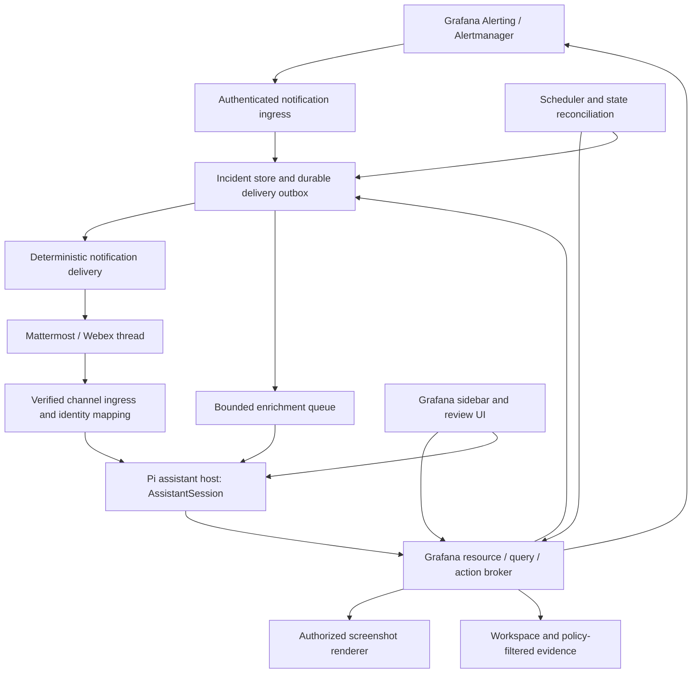

# Conversational alerting and Mattermost/Webex

Reviewed 2026-09-25, revised 2026-09-29. This extends [the architecture
roadmap](../ROADMAP.md). It proposes a product and implementation direction; no
integrations were enabled, messages sent, or alerting configuration changed
during this review.

## Recommendation

Build an **incident assistant around Grafana Alerting**: reliable alert delivery,
an ongoing conversation for each incident, evidence and screenshots, authorized
silencing, and scheduled follow-up. Preserve Grafana/Alertmanager as the authority
for alert evaluation, notification routing, and silences. Maintain explicit
incident state, delivery state, and automation grants outside the LLM transcript.

**The runtime stays Pi.** The server host is an app-owned Node service that runs
the same UI-independent `AssistantSession`, session filesystem, and shell
commands as the browser, with `pi-agent-core` as the agent loop. Channel
adapters (Mattermost first, then Webex), the scheduler, and the delivery outbox
are part of that service. OpenClaw is not adopted as a host, harness, or
dependency; the [patterns borrowed from OpenClaw](#patterns-borrowed-from-openclaw)
section records what its design contributes to ours.

The tool surface is the same in Grafana and channel conversations: `read`,
`write`, `edit`, and `bash`, with Grafana and incident operations as shell
commands and `evidence show` for deliberate presentation of captured artifacts.

The decision was made because the reviewed OpenClaw revision owns its own agent
core (`packages/agent-core`, `src/agents`, `src/llm`); only `pi-tui` remained a
Pi dependency. Adopting it would have meant replacing the working Pi agent,
compaction, and session model, plus constraining a broad operator-oriented
runtime to the four-tool surface. A Pi host reuses `AssistantSession` directly.

## What the experience should support

An example incident thread, with illustrative values:

```text
Assistant: Checkout error-rate alert is firing in production.
           First observed 14:02 UTC; 3 instances; observed value 8.4%.
           [Investigate] [Show panel] [Acknowledge] [Silence options]

Operator: Compare with the previous hour and check the related latency panels.
Assistant: Error rate increased at 14:01; latency increased two minutes later.
           Here are the selected panels and query evidence. The cause is unconfirmed.

Operator: Silence only checkout in eu-west for 30 minutes, and keep watching it.
Assistant: Proposed silence: Grafana Alertmanager, this rule, checkout, eu-west.
           Currently matches 3 instances. Ends 14:38 UTC.
           Monitoring continues; notifications matching the silence are suppressed.
           [Confirm this silence] [Cancel]

Assistant: Silence created. I will check every 5 minutes for the next 30 minutes,
           report recovery here, and stop after the final check.

Operator: Give me a fresh screenshot and stop the periodic updates.
Assistant: [timestamped screenshot] Periodic updates stopped. Silence still ends
           at 14:38 UTC. [Expire silence now]
```

The initial alert, its delivery, and the actual silence result must remain useful
when the model or image renderer is unavailable. Natural-language requests select
workflows; deterministic services own their effects.

| Experience                   | Added behavior                                                                                 | Source of truth                                      |
| ---------------------------- | ---------------------------------------------------------------------------------------------- | ---------------------------------------------------- |
| Alert thread                 | Deduplicated root notification, firing/resolved updates, related evidence                      | Alertmanager state plus incident store               |
| Conversational investigation | Questions, bounded metrics/count queries, comparisons, runbook references, follow-up questions | Broker results and cited artifacts                   |
| Screenshots                  | Alert-time image, refreshed panel, selected related panels, explicit variables/time range      | Render service and artifact metadata                 |
| Acknowledge/assign           | Named responder and handoff notes                                                              | Incident store, or a chosen external incident system |
| Silence/expire               | Preview exact matchers/duration, apply, inspect, end early                                     | Selected Alertmanager                                |
| Watch/recheck                | “Check in 10 minutes”, “watch for 30 minutes”, “tell me when recovered”                        | Structured, expiring automation                      |
| Proactive briefings          | Shift handover, active incidents, recurring noise reports                                      | Approved schedule and scoped evidence                |
| Rule/dashboard improvements  | Propose threshold, query, layout, or runbook edits and review them                             | Shell commands and reviewed change sets              |

Grafana already supports silences and screenshots in supported notification
setups. The expansion is the persistent conversation, richer investigation,
delivery options, and controlled follow-up around those features.

## System design and ownership



Separate these owners even if some run in the same process:

- **Grafana/Alertmanager:** rule evaluation and health, active instances,
  notification grouping/inhibition, silence state, and durable rule/config writes.
- **Incident service:** source event journal, episode identity, current observed
  state, acknowledgement, thread bindings, action receipts, and reconciliation.
- **Agent host:** model turns, conversation history, context compaction, tool
  execution orchestration, and human-facing progress. This is `AssistantSession`
  attached to a server `SessionHost`.
- **Broker:** effective permissions, schema/count restrictions, rendering policy,
  immutable action plans, and Grafana API operations.
- **Channel adapter:** verified sender/message identities, platform formatting,
  media upload, reply/thread addressing, interaction callbacks, and delivery receipts.
- **Scheduler:** bounded follow-up jobs and renewal/cancellation. One owner per job.

Use a versioned host interface such as `startTurn`, `cancelTurn`,
`getTranscript`, `deliver`, and `scheduleCheck`, and map channel-specific
message and thread IDs to app session and incident IDs at the adapter.

### An incident is more than a conversation

Store at least:

```text
Incident
  id, grafanaInstanceId, orgId, alertmanagerId, routingPolicyId
  alertInstances[] { fingerprint, startsAt, ruleUid?, labelsProjection, observedState }
  groupKey, episode, receivedAt, lastReconciledAt, evidenceFreshness
  sourceStatus, responderStatus, notificationStatus
  acknowledgement { actor, timestamp, comment }?
  deliveries[] { channelAccount, room, rootMessage, thread, audiencePolicy, receipt }
  evidence[] { artifactId, resourceRevision, timeRange, policyVersion }
  actions[] { changeSetDigest, actor, receipt, resultingSilenceId? }
  watches[] { jobId, ownerGrant, expiry, predicate, cadence, destination }
```

Keep source state (`firing`, `resolved`, `unknown/stale`), responder state
(`unacknowledged`, `acknowledged`, `closed`), and notification suppression separate.
An acknowledgement does not silence anything; a silence does not resolve anything;
a conversation can close while the source remains firing. Missing data or loss of
access is not recovery.

Scope an alert instance by instance/org/Alertmanager/fingerprint and firing episode
(`startsAt` plus reconciliation as needed). Scope group keys by receiver/routing
policy; group membership changes over time. Store per-alert status even when the
notification group reports `firing`. A repeated delivery updates the existing
episode; a later recurrence can start a linked episode. Correlation across rules
is initially a suggestion and must not merge away independent alert lifecycles.

One incident can have multiple delivery records with different audience policies.
Do not merge private DM transcripts into a public incident thread. Cross-channel
handoff publishes an approved summary and evidence references.

## Notification ingestion and reliability

Use a Grafana webhook contact point targeting the incident ingress. Configure
authentication, body-size limits, and preferably Grafana HMAC with its optional
signed timestamp; verify the raw request before parsing. Bind its credential to
an instance/org/receiver policy rather than trusting payload `orgId` or URLs.
The standard payload includes per-alert fingerprints/status, group keys, related
URLs, and a truncation count. [Grafana webhook contract](https://grafana.com/docs/grafana/latest/alerting/configure-notifications/manage-contact-points/integrations/webhook-notifier/).

The ingestion sequence should be:

1. Authenticate and validate the event; project permitted labels, annotations,
   and values before storing agent-visible content. Alert text may itself contain
   raw logs/rows, secrets, or instructions from untrusted sources.
2. Durably record the event and enqueue a basic notification, then acknowledge
   HTTP delivery. Do not wait for an agent turn, a screenshot, or channel posting.
3. Resolve/create the incident episode and its channel root. Persist the platform
   message ID and delivery receipt. Send a concise deterministic alert first.
4. Coalesce enrichment work per incident revision. The agent adds a bounded
   evidence-backed update, with source timestamps and uncertainty.
5. Reconcile with source APIs on relevant transitions and a bounded interval.
   Record degraded/unknown state if source access fails.

At-least-once processing is the practical target. Distinguish transport retries
from legitimate repeat reminders; a fingerprint alone cannot identify a message.
Deduplicate identical event/state revisions while retaining changed values and
repeats required by the notification policy. Handle delayed resolved events and
out-of-order firing events with source state reconciliation. A truncated group or
an alert absent from a webhook is not evidence that the alert resolved.

Coalesce alert storms before model calls, limit per-team model/render budgets,
cancel obsolete enrichment, and prevent late work for an old revision from
overwriting the latest status. Persist failed/unknown delivery for retry or review.
Channel transport idempotency varies; do not promise exactly-once messages after
an ambiguous remote timeout. Preserve an incident marker to aid reconciliation.

Keep a native Grafana contact-point fallback during rollout. Start with a separate
test destination to avoid double-paging. Production routing must explicitly choose
primary, fallback, and escalation behavior; neither the LLM nor a generic heartbeat
decides whether a critical initial alert is delivered. Monitor the bridge from an
independent path so failure of the bridge can itself be reported.

## Screenshots as evidence and channel attachments

There are two complementary image paths:

1. **Grafana notification capture:** reuse a permitted alert-linked capture when
   available. Grafana's webhook integration references externally stored images;
   it does not upload local image bytes. This path has datasource/Alertmanager and
   renderer restrictions. [Grafana image notifications](https://grafana.com/docs/grafana/latest/alerting/configure-notifications/template-notifications/images-in-notifications/).
2. **Broker rendering:** render an authorized dashboard/panel on demand or during
   enrichment, then upload the resulting artifact through the channel API. This
   also supports related panels and refreshed evidence after the initial alert.

The app's existing `renderDashboardScreenshot` in
[`domain/dashboards.ts`](../src/pages/Chat/domain/dashboards.ts) uses browser
globals, the current browser session, and `/render/d[-solo]/...`. Extract the
operation behind a server render service; reusing the frontend function cannot
power an unattended alert. Keep live unsaved-dashboard rendering a distinct
browser feature.

Each image records instance/org, dashboard UID and revision, panel identity,
selected variables, absolute time range, timezone, dimensions, capture time,
and applicable policy. Distinguish a capture taken during firing from a later
render of historical data: dashboard changes and data retention can change what
the latter shows. Include accessible text and Grafana links with every image.

Render from broker-resolved resource IDs; do not follow arbitrary notification
`panelURL`, `imageURL`, or runbook URLs with privileged credentials. Allow-list
origins, restrict redirects, and prevent cross-tenant media cache reuse. Use fixed
presets for dimensions, query range, concurrency, and timeout. Rendering failure
adds a diagnostic to the thread and never blocks the alert.

Screenshots must honor the schema/count-only policy. A log/table panel, annotation,
tooltip, text panel, label, or variable can reveal prohibited content. Prefer
approved panel types/dashboards or a purpose-built incident dashboard containing
only allowed aggregate evidence. If the content cannot be validated, deny the
image and provide allowed counts and links. Image redaction after rendering is
not the primary enforcement boundary. Do not forward alert-captured images without
checking the same audience/content policy.

The logging source is Elasticsearch. Incident investigation and scheduled watches
use the broker's approved field metadata and document/time-bucket counts. They
must not retrieve document hits, `_source`, highlighted snippets, or representative
events through dashboard queries or aggregation subrequests. Apply the same policy
to Elasticsearch-derived alert annotations before model input or channel delivery;
an alert payload can already contain prohibited event content. Failed or partial
shard results mean incomplete evidence, not recovery. See the
[Elasticsearch access design](../ROADMAP.md#elasticsearch-logs).

Uploading an image copies its contents into Mattermost/Webex retention and access
controls. An expiring Grafana URL does not expire an uploaded platform copy.
Keep image delivery and model vision input separate: a text-only model can request
and deliver a screenshot using structured query evidence, without receiving its
pixels. Both uses require explicit content policy.

## Silencing and other incident actions

Grafana silences suppress notifications for a time window without stopping rule
evaluation, and apply to a specific Alertmanager. Mute timings are recurring
notification-policy controls. [Grafana silence semantics](https://grafana.com/docs/grafana/latest/alerting/configure-notifications/create-silence/).

| User request           | Effect                                                  | Initial policy                                                                            |
| ---------------------- | ------------------------------------------------------- | ----------------------------------------------------------------------------------------- |
| “Acknowledge this”     | Record responder ownership in the incident system       | Authorized responder; audit actor and timestamp                                           |
| “Stop your updates”    | Cancel a watch or snooze this bot's updates             | Owner/team-scoped operation; no Grafana suppression                                       |
| “Silence this for 30m” | Create a bounded silence on the identified Alertmanager | Exact target/matcher plan, current permission, explicit approval or narrow existing grant |
| “Unsilence this”       | Expire the identified silence early                     | Preview the affected scope, check current permission, journal result                      |
| “Mute every night”     | Change recurring notification policy/mute timings       | Higher-impact configuration change-set workflow                                           |
| “Pause the rule”       | Change evaluation behavior                              | Separate capability and approval; never inferred from “silence”                           |
| “Raise the threshold”  | Change rule definition                                  | Validated rule change set with visible before/after (`workspace apply`)                   |

Proposed shell commands (not yet implemented, except that alert rule edits go
through `workspace apply`):

```text
grafana-alert instances --incident INC-42
grafana-alert silence --incident INC-42 --duration 30m --scope selected-instances
grafana-alert silence inspect <silence-id>
grafana-alert silence expire <silence-id>
incident acknowledge INC-42
incident watch INC-42 --every 5m --for 30m --on recovery
```

Silence creation and expiry stage a change and open the same trusted review as
`workspace apply`; the approval binds to the digest of exactly what is shown.
A silence change binds instance/org/Alertmanager, exact matchers and their
operators, rule identity where supported, absolute start/end, reason, actor,
incident ID, and the observed affected set. Prefer positive equality matchers
over broad regex or negative matchers. Matchers can affect future instances too:
the current match count is a preview, not a permanent bound. Reject
empty/general scope unless the caller has a separately authorized policy for it.
Do not create a silence from `commonLabels` alone without establishing the
intended scope.

Enforce maximum duration and approved label/rule scope server-side. Broader or
regex silences require broader authority. Re-evaluate scope and current permissions
at apply time; if approval is stale, expiry passed, or affected scope materially
changed, refresh the review. Record the returned silence ID, re-read to verify, and
report the exact end time. An HTTP admission response alone is not a verified effect.

Use the operation journal for duplicate clicks and retries. A timed-out create is
an unknown outcome; search/reconcile using the operation identity and recorded
target before creating another silence. Do not blindly retry creates or claim
atomic conditional updates if that Alertmanager API lacks them. Serialize
app-owned changes and detect concurrent changes where possible; document the
remaining race for APIs without compare-and-swap semantics.

The local Grafana source has specific silence authorization in
`pkg/services/ngalert/accesscontrol/silences.go`. Its built-in routes include
`/api/alertmanager/grafana/api/v2/silences` for create/update and
`/api/alertmanager/grafana/api/v2/silence/{SilenceId}` for lookup/expiration.
External Alertmanagers have separate datasource routes. Implement versioned
adapters; do not treat dashboard-write permission as silence permission, and do
not use the notification's `silenceURL` as an API authorization token.

**Silencing creates a notification-observation gap.** A silenced alert may produce
no recovery webhook. Watches must reconcile current alert/rule state through
approved APIs. Mark polling failures stale, not resolved. Honor notification
suppression for new unsolicited messages; continue an explicitly requested watch
only within its independent grant. A silence expiring is not evidence of recurrence,
and cancellation of a watch must not accidentally cancel the silence.

## Conversation and autonomy

Support direct conversations and incident threads, with mention-based activation
outside threads the assistant owns. Within an incident thread, follow-up questions
should reuse the task state and evidence without requiring a new command every time.
Show short progress, permit correction/steering, and make stop/cancel effective
across queries, rendering, model turns, and pending scheduled work.

Add controlled memory in three scopes:

- **Incident:** evidence, timeline, hypotheses, actions taken, pending work. This
  is the incident session's `/session/findings.md` plus the incident store.
- **Team:** curated runbooks, service ownership, approved dashboard mappings,
  notification destinations, and explicit operating preferences. Admin-managed
  skills are the first vehicle.
- **User:** private preferences and personal task state, excluded from team output
  unless deliberately shared.

Distinguish observed facts from generated hypotheses. Treat annotations, runbooks,
messages, and filesystem content as data that cannot grant new permissions. A
skill file can explain an approved program; it cannot authorize a silence,
expand datasource access, or make a private transcript public.

“Keep an eye on it” should become a reviewable structured watch, including its
target, evidence query, interval, end time, maximum runs/cost, recovery predicate,
destination, actor/grant, and stop conditions. Ask only for missing material scope;
use visible team defaults for routine values. After acceptance, the agent can run
the checks and report within that grant without asking permission on every tick.

Use deterministic scheduling and evidence predicates for promised rechecks,
silence-expiry notices, and escalation timers. Model calls explain changes or
investigate within budgets. A generic heartbeat is suitable for optional briefings,
not an exact operational deadline or the sole critical alert detector.

Schedules retain explicit delegated authority after a chat disconnects, with
current-policy checks at execution. Cap and expire that authority; revoke it when
the user/team mapping or destination permission is removed. Stop on expiry,
requested cancellation, sustained recovery, exhausted budget, or revoked access.
Do not convert “watch this” into permanent autonomous monitoring.

Additional programs can correlate several alert groups, flag a sustained aggregate
trend, or produce a handover even when no rule fires. Record these as
`agent-observation` or `scheduled-review` events with their evidence and confidence;
do not present them as Grafana firing alerts. Promote a useful persistent condition
into a reviewed Grafana rule where it can be evaluated deterministically. Any
autonomous notification program still needs an approved audience, query scope,
cadence, budget, and escalation policy.

## Patterns borrowed from OpenClaw

OpenClaw is a persistent gateway for chat-channel agents. The review of its
source (revision `2d84bb11af0`, 2026-09-25) found several designs worth copying
into the Pi host without taking the dependency. These are design notes, not
claims about current OpenClaw behavior.

| OpenClaw concept                                                                  | What we adopt                                                                                                                                                                                                  |
| --------------------------------------------------------------------------------- | -------------------------------------------------------------------------------------------------------------------------------------------------------------------------------------------------------------- |
| Gateway that owns sessions; channels are plugins                                  | The host owns `AssistantSession`s; Mattermost/Webex are adapters behind one channel interface (ingress, identity, threading, media, interactions, receipts). Adding a channel does not touch the agent loop.   |
| Session routing keyed by channel, account, and thread                             | A session key derived from verified platform IDs (`channel:account:room:thread`), mapped to an app session and incident ID. Threads are explicit for incident conversations, not the platform default.         |
| Deterministic commands next to model tools (`registerCommand` vs. `registerTool`) | Buttons and slash commands (`acknowledge`, `confirm silence`, `stop updates`) run deterministic handlers with the verified clicker as actor; they never become a model message that says "yes".                |
| Persisted cron jobs and background tasks with run admission                       | Watches and briefings are stored jobs with an owner grant, expiry, and run cap. A run is admitted only if the grant is still valid; one scheduler owns each job.                                               |
| Durable outbound delivery queue with recovery on restart                          | An outbox for channel messages: persist first, send, record the platform receipt; on restart, recover pending entries and reconcile ambiguous ones instead of re-sending blindly.                              |
| Interrupted-turn recovery for persisted sessions                                  | A turn interrupted by host restart resumes from the persisted session and tool-run state. Writes are reconciled through the operation journal before the model continues.                                      |
| Heartbeat versus exact cron                                                       | Heartbeats only for optional, best-effort briefings; exact deadlines (silence expiry, recheck at T+10m) use scheduled jobs.                                                                                    |
| Mention activation in shared rooms, free follow-up in owned threads               | Same activation rules for Mattermost/Webex.                                                                                                                                                                    |
| One trust boundary per gateway; session keys are not authorization                | One host deployment per trust domain where users' Grafana permissions differ materially, and a short-lived broker grant per turn that carries the principal. Channel routing is never access control.          |
| Separate session metadata projections and bounded transcript reads                | Already reflected in the PostgreSQL session store (metadata listing without the snapshot); message-level paging stays a later optimization. See [session performance](session-performance-and-persistence.md). |

What we explicitly do not copy: native host exec, a generic filesystem or
browser tool, cross-session search, global memory, delegation or nested agents,
self-modifying configuration or plugins, and model-runtime fallback. The tool
surface stays `read`, `write`, `edit`, and `bash` over the restricted session
filesystem.

## Mattermost and Webex implementation

| Capability           | Mattermost                                                           | Webex                                                                  |
| -------------------- | -------------------------------------------------------------------- | ---------------------------------------------------------------------- |
| Conversation ingress | Bot account, REST APIs, authenticated WebSocket post events          | Verified message webhooks, then authenticated resource retrieval       |
| Incident thread      | Root post plus replies; persist root ID                              | Parent message/thread addressing, verified for the deployed client/API |
| Interaction          | Interactive message buttons/dialogs or slash commands                | Adaptive Cards and attachment-action webhooks                          |
| Screenshots          | Upload permitted image and post attachment in the thread             | File attachment or supported image presentation, with text fallback    |
| Work needed          | Adapter, Grafana identity mapping, audience policy, incident binding | The same controls plus card/action handling                            |

### Mattermost

Implement the adapter in the host against Mattermost's REST and WebSocket APIs:
reconnect with backoff, resume from the last seen post, route posts by root ID,
and ignore the bot's own posts. Set incident conversations to reply in the
incident thread explicitly.

Buttons that carry authority ("Confirm silence", "Expire silence") use
Mattermost interactive message callbacks to a host endpoint that verifies the
platform request, the actual clicker, and an unforgeable action ID bound to the
change-set digest, message, room, and expiry. Buttons without authority
("Investigate", "Show panel") may become agent input. Do not interpret arbitrary
text "yes" as authority for whichever action is pending. Alternatively, link to
the Grafana review UI. [Mattermost interactive messages](https://developers.mattermost.com/integrate/plugins/interactive-messages/).

Bind authenticated platform user IDs to Grafana principals; mutable usernames
are display data. The bot's channel membership is not a user's Grafana
authorization. Test duplicate clicks, forwarding, deleted posts, and removed users.

### Webex

Implement a second adapter against the same channel interface. Verify webhook
signatures against the raw request body using the documented contract for the
configured webhook type, retrieve messages/attachment actions with the bot
credentials, deduplicate IDs, ignore the bot's own messages, and bind platform
person/room IDs to trusted app identities. [Webex webhook guide](https://developer.webex.com/messaging/docs/api/guides/webhooks).

Webex action notifications require a separate authenticated fetch to obtain the
submitted fields. Include accessible fallback text. Its documented card limitations
also restrict editing cards that contain images, so keep an updatable text/action
card separate from screenshot messages. [Webex Buttons and Cards](https://developer.webex.com/messaging/docs/buttons-and-cards).

Version a channel-neutral `IncidentPresentation` containing text, facts, evidence
references, and action IDs. Render it differently per platform. An action ID refers
to backend state; it must not contain credentials or editable raw API arguments.
Disable/expire stale actions server-side even when a platform cannot update the
old card. A reply should describe the committed result and link to its receipt.

### Deliberate evidence in conversations

`evidence show PATH --view table|json|text|image` presents a captured file
without running its query again. For channels it emits a presentation event with
the artifact reference and view; the adapter renders it as text, a static image,
and links. For example, the agent runs `grafana-prom query`, inspects the
captured result, then presents the relevant chart in the incident thread. This
separates a command's execution log from the evidence the responder should see.

The delivery adapter enforces the current thread and audience, deduplicates
presentation events, and returns a receipt. Rendering must not rerun the query,
fetch arbitrary image URLs, or execute a panel's embedded queries. Explicit
refresh creates new timestamped evidence.

Initial alerts, firing/resolved transitions, approval requests, action outcomes,
and watch expiry remain deterministic system presentations. They must be visible
even if the agent never presents evidence or its model provider fails. Agent
captions are commentary, distinct from captured values and authoritative state.
Restricted Elasticsearch/MSSQL evidence contains only approved schema/count
results, including safe labels and pixels; channel presentation is not a separate
raw-content access path.

## Host guardrails

Keep the broker authoritative even if the host is compromised within its allowed
scope. Give each turn a short-lived server-issued grant identifying
principal/team, incident, allowed operations, audience, and expiry. Never accept
`userId`, `approved`, or an arbitrary destination from model arguments as authority.
Background work uses a distinct automation grant. Credentials remain outside
the agent shell; resources returned to it already satisfy the data policy.

An incoming Grafana alert has no human caller. Give its initial enrichment an
administrator-configured notification grant tied to that receiver, permitted
folders/datasources, and destination audience. Start it with read/render rights;
silencing requires an authorized human action or an explicitly configured narrow
automation policy. Never impersonate the last person who chatted with the bot or
derive service authority from labels in the notification.

A broker cannot remove information already visible in another session's transcript
or memory. Where users must not share such data, separate host deployments and
stores by trust domain. A common Grafana org does not imply identical
folder/datasource access. Even within a trusted team, publish only content
approved for the room audience, including future channel members who can read
retained history.

The Grafana browser connects through the Go plugin as the authenticated facade,
never with a host operator credential. The live dashboard bridge remains tied to
the authenticated browser and the expected dashboard revision; a chat-channel run
cannot assume that bridge exists.

## Delivery plan and changes to the main roadmap

| Step                                | Scope                                                                                                                                                                  | Evidence needed before enabling the next step                                                                                                                  |
| ----------------------------------- | ---------------------------------------------------------------------------------------------------------------------------------------------------------------------- | -------------------------------------------------------------------------------------------------------------------------------------------------------------- |
| A0 — Pi host and identity spike     | Node service running `AssistantSession` with a server `SessionHost`, broker-issued grants through the Go plugin, Mattermost test channel, same four tools and commands | Sender identity verified, the tool inventory is exactly the four tools, session/thread mapping stable, plain synthetic alert round trip                        |
| A1 — Reliable incident delivery     | Grafana contact point ingress, incident journal, deterministic text delivery, per-episode threads, deduplication/reconciliation, outbox; model enrichment optional     | Duplicate/out-of-order/truncated events handled; model/renderer outage does not prevent alert delivery; fallback and bridge failure reporting work             |
| A2 — Evidence and responder actions | Presentation events for `evidence show`, selected panel screenshots, acknowledgement, silence review and approval callbacks, expire-silence action                     | Audience and restricted-data tests pass; duplicate/stale clicks cannot create extra silences; timeouts reconcile; permissions revoked mid-flow deny the action |
| A3 — Continuing assistance          | Follow-up conversation, steering/cancel, bounded watches, recovery reports, silence-expiry checks, curated team memory                                                 | Scheduled authority expires/revokes; silence does not blind recovery checks; checks stop at their cap; no cross-room/private-memory disclosure                 |
| A4 — Webex                          | Channel adapter, files/cards, action retrieval, message/thread and identity mapping                                                                                    | Same incident/action contract suite as Mattermost; stale image/card fallback, duplicate webhooks, bot-echo prevention, room isolation                          |
| A5 — Grafana sessions on the host   | Optionally run Grafana sidebar/page sessions on the host too (M4), with the browser as a view; the live dashboard bridge stays in the browser                          | Runs survive closing Grafana; reconnect and interrupted-turn recovery; no duplicate schedulers or commit owners                                                |

A1 can ship before alert-definition editing is complete. Silencing is a separate
operational capability from changing a rule. A2 reuses the change-set review and
operation journal of `workspace apply`, but does not require finishing every
filesystem mount. Begin with one Grafana instance, one Alertmanager, one trusted
team and Mattermost; then add external Alertmanagers and Webex.

Acceptance scenarios should include:

- A firing alert creates one thread; repeats and resolution update the right
  episode; recurrence is distinguishable from a delayed retry.
- Three firing instances in one group can be investigated and silenced narrowly
  without suppressing unrelated rules or environments.
- A screenshot uses the intended absolute time range, variables, and audience;
  prohibited log/table/annotation content never reaches a platform or model.
- A silence succeeds despite loss of its HTTP response; restart/retry discovers
  that effect without creating a second silence.
- A source alert resolves while silenced; reconciliation detects it. An unavailable
  source is reported stale and never mislabeled recovered.
- Two responders act concurrently; action versions, ownership, and receipts remain
  coherent. A forwarded/stale button and a revoked user cannot authorize a write.
- An incident storm sends deterministic notifications within the team's agreed
  delivery target while LLM/render jobs are coalesced and bounded.
- Host restart, chat reset, model overflow, and temporary channel failure retain
  incident/action state and queued delivery without replaying committed actions.
- A malicious annotation cannot issue commands, widen a watch grant, alter memory
  policy, fetch raw SQL/log content, or send evidence to an arbitrary destination.

Measure ingress-to-first-notification latency, delivery backlog age, deduplication,
thread-binding failures, evidence freshness, rendering failures, action denial and
unknown outcomes, watch expiry, and model cost per incident. Use an independent
monitor for the bridge and an explicit operational owner for dead-letter events.

## Review scope

The 2026-09-25 review inspected the local OpenClaw package/runtime layout,
Mattermost routing/identity and presentation implementation, tool/harness
extension contracts, automation and session documentation, and delivery-queue
source locations, and compared them with the local Grafana silence API and
authorization source and this app's screenshot implementation. It checked
official OpenClaw, Grafana, Mattermost, and Webex documentation.

The 2026-09-29 revision dropped OpenClaw as a host candidate in favor of a Pi
host and kept its concepts as design input. No OpenClaw/Mattermost/Webex
instance was launched or changed, and no live alert, screenshot delivery, or
silence was executed.
