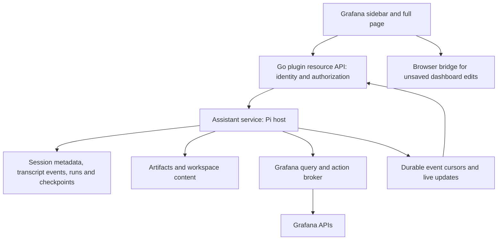

# Session performance and persistence design

The PostgreSQL metadata/snapshot design is now implemented. See
[configuration, migration and HA tests](session-storage.md) for the shipped
behavior. The alternatives and remaining optimizations below record the original
analysis; transcript virtualization and a durable server-side agent runtime are
not part of this implementation.

Reviewed 2026-09-28 against Pi app `4fa55e0`, local Grafana source
`2cf60b2a9c1`, installed `@grafana/runtime` 13.2.1, and local OpenClaw
`c136ec63146` (package version 2026.9.6).

## Recommendation

Introduce an app-owned session API that returns metadata separately from history.
Fix deletion, retention semantics, duplicate saves, and transcript rendering in
parallel. A new database without a different access pattern would preserve the
main performance problem.

Updated direction after discussion: retain the browser Pi runtime and existing
Go plugin backend; support HA Grafana with PostgreSQL from the outset. Do not add
OpenClaw, rqlite, a standalone agent service, or a plugin-owned SQLite file.
Support both a dedicated schema in Grafana's existing PostgreSQL database and
a separate application database, using the same implementation. The shared
database layout is a first-class deployment option for operational simplicity.
Use a dedicated role and explicit connection configuration in either layout;
Grafana's internal tables remain outside the application's ownership.

Start with indexed metadata and one snapshot per session, saved atomically.
The list endpoint never selects the snapshot. This preserves deployment simplicity
while solving the all-histories download; message-level storage is a later
optimization. The OpenClaw comparison and deployment alternatives below remain
research context, not the selected implementation plan. The earlier
[conversational alerting design](conversational-alerting.md) is also outside the
current scope.

## HA Grafana and PostgreSQL follow-up

Reviewed the local Grafana source rather than assuming that a plugin can share
Grafana's in-process database handle. Relevant findings:

- `pkg/storage/unified/sql/backend.go:142` selects SQL storage by default and
  obtains its database through Grafana's internal `DBProvider`.
- `pkg/storage/unified/sql/server.go:390` enables resource-storage HA by default
  for non-SQLite configurations, subject to the explicit database HA setting.
- `pkg/registry/apis/userstorage/storage.go` uses the generic resource store.
  Existing server-side user storage already benefits from shared Grafana storage;
  its payload shape and browser cache are the problems, not absence of a database.
- `pkg/registry/apis/appplugin/register.go:173` and `:198` can register app-manifest
  kinds through the router-middleware path or legacy app-plugin flags.
  `pkg/tests/apis/appplugin/withmanifest_test.go` contains CRUD and resource-version
  conflict coverage for those kinds.
- However, `grafana.useRouterMiddleware`, `appplugins.registerAPIServer`,
  `appplugins.loadAppManifest`, and `appplugins.loadAppManifestAndKeepSettings`
  are experimental and default false in `pkg/services/featuremgmt/registry.go`.
  Availability must be checked against an actual supported release/configuration,
  not inferred from this development checkout.
- `pkg/registry/apis/appplugin/authorizer.go:96` starts from plugin access and
  kind/folder policy. Declaring an owner field does not itself enforce private
  per-user access. Direct resource GET/list/watch/search paths must also be safe.
- The ordinary plugin SDK exposes request context, settings and resources, not
  Grafana's internal `DBProvider` or an automatic application database connection.
  Its SQL configuration contains pool defaults, not Grafana's database credentials.

Native app resources could eventually avoid separate database credentials, but
are not the conservative production baseline here. Splitting histories across
invented user-storage service names is also a poor substitute: the public hook is
plugin-scoped, ordinary users cannot list arbitrary user-storage resources, and
cross-object atomic updates would still be missing.

Proposed topology:

```text
                        ┌─ Grafana A + Go plugin ─┐
Browser → load balancer ─┤                         ├→ shared PostgreSQL cluster
                        └─ Grafana B + Go plugin ─┘     └─ Grafana database
                                                           ├─ Grafana schema
                                                           └─ grafana_pi schema
```

Alternatively, the plugin connects to a separate database containing the same
`grafana_pi` schema. Only connection configuration changes between layouts.

No session correctness may depend on a replica's disk, in-memory cache or mutex.
No additional sticky routing is needed for session CRUD. Keep initial reads on
the PostgreSQL primary endpoint so a save followed by a read on another Grafana
replica does not encounter asynchronous database-replica lag.

For the first version:

1. Store metadata and a JSON snapshot with a shared revision, either in one row
   or two tables updated in one transaction. Index list queries by deployment,
   org, plugin variant, stable owner identity, activity time and ID. Bound pages
   and omit snapshots from list SELECTs. Keep artifacts in PostgreSQL initially
   to avoid adding a shared blob store; enforce snapshot size quotas.
2. Use conditional updates against the expected revision and return a conflict
   for stale writes. Add request IDs for safe retries after an ambiguous network
   failure. Make deletion conditional too; stale saves must not recreate a
   deleted session through an unconditional upsert.
3. Apply migrations once per application schema under a database lock or a
   deployment migration job. Use additive migrations for rolling upgrades. Bound each pool
   with the total number of Grafana replicas and org plugin instances in mind.
4. Provision dedicated credentials consistently to every replica through a
   deployment secret or encrypted plugin configuration. Do not infer/reuse
   Grafana's internal database credentials. Include the assistant schema/database in
   backups, failover and restore procedures explicitly.
5. Derive identity from authenticated server context. The current Go SDK's
   `backend.User` only contains login/name/email/role, not a stable UID; the
   implementation must resolve or validate the stable principal through a
   supported trusted identity path. Do not accept a browser-supplied owner UID
   or use mutable email as the authority. Test renamed users, org switching and
   cross-user requests.
6. Surface storage outages instead of silently claiming success after falling
   back to localStorage. A local unsaved draft can be retained, but must remain
   visibly unsynchronized. Avoid replica-local session caches initially.

An existing streaming model request remains attached to the Grafana replica that
accepted it. Pod failure can interrupt that stream even with HA persistence.
Keep the browser's current state and report interruption; do not automatically
replay a turn that may have issued Grafana writes. Durable background execution
and seamless run failover remain separate work, outside this simple store change.

Required integration verification before claiming HA support: run two Grafana
replicas against PostgreSQL, create on A and immediately read/list on B, alternate
requests without affinity, race updates and delete/save across replicas, retry a
committed write whose response was lost, restart a replica, exercise PostgreSQL
failover, and test rolling schema upgrades and restore. Include large histories
and verify that list payload size stays independent of their size. This follow-up
is a source/design review; that two-replica integration test has not been run.

## PostgreSQL schema configuration contract

Both layouts are required, not separate storage drivers:

| Layout                        | Connection database, illustrative | Application schema |
| ----------------------------- | --------------------------------- | ------------------ |
| Shared with Grafana           | `grafana`                         | `grafana_pi`       |
| Separate application database | `assistant`                       | `grafana_pi`       |

Expose an explicit schema setting with proposed default `grafana_pi`, independent
of the database connection settings. Connection secrets belong in deployment
secrets or `secureJsonData`; the schema name is non-sensitive configuration.
These are design requirements, not settings implemented in the current plugin.

- Qualify all application table references, including migrations and the migration
  ledger, with the configured schema. Validate the schema as a bounded PostgreSQL
  identifier and quote it with the driver identifier API; value placeholders
  cannot substitute SQL identifiers. Do not rely on a pooled connection's ambient
  `search_path`. Exclude system schemas and `public` as application schema targets.
- Keep the ledger in that schema, for example `grafana_pi.schema_migrations`.
  Scope the migration lock by application and schema within the database: all
  replicas targeting one schema coordinate, while two independent schemas have
  independent migration histories. Use one stable lock identity across releases.
- Support a schema pre-created by the DBA, so the runtime needs no database-wide
  `CREATE` privilege. The simple deployment can let the dedicated assistant role
  own its schema and run migrations there. Also permit deployment-run migrations
  with a separate owner role and a runtime role limited to schema usage and the
  required table/sequence privileges, including future migrated objects.
- Never alter Grafana's tables, migration ledger, role defaults, or database-wide
  search path. Installation must not change privileges on Grafana's schema.
  A separate schema organizes names; role privileges provide access isolation.
  [PostgreSQL schema behavior](https://www.postgresql.org/docs/current/ddl-schemas.html)
  and [privileges](https://www.postgresql.org/docs/current/sql-grant.html).
- All replicas use the same database, schema and stable deployment namespace.
  Changing the schema selects another store; it does not migrate histories.
  Keep org/user/plugin scope in the data model even when using a dedicated schema.
- A full-database backup in the shared layout should include the assistant schema;
  verify this in existing backup filters. Support schema-scoped logical export
  and restore, including ownership/grants. Whole-database recovery affects both
  Grafana and assistant state; a schema is not a separate failure domain.

Acceptance coverage must exercise both layouts. In a shared database, verify
Grafana-owned objects remain unchanged after application migration/CRUD/deletion,
two assistant schemas do not interfere, migrations coordinate across replicas,
schema selection survives pool reconnects, and the dedicated runtime role cannot
modify Grafana tables. Test using a pre-created schema without database-wide
creation privileges and with a non-default schema name.

## What happens today

The agent loop lives in the browser. `AssistantSession` owns the Agent, workspace,
artifacts, compaction state, approvals, and a save queue. Page/sidebar handoff can
retain the same object in the module-level `chatRunRegistry`. This survives a view
handoff within the page, not a browser reload, process failure, or pod restart.
The Go backend provides model streaming and other resources; it does not own a
durable agent-run lifecycle.

Persistence uses `usePluginUserStorage()`:

- `sessions:index`: JSON string containing ID, title, creation and update times.
- `sessions:<id>`: JSON string containing the entire transcript, model settings,
  workspace, artifacts, and compaction state.
- The sidebar renders at most eight index items; the full page renders the index,
  which saves trim to 50 entries.

These are keys inside **one Grafana user-storage resource per plugin/user**, not
independently retrievable server objects. For signed-in users, the first
`getItem()` initializes the storage by GETting the complete resource. Grafana
caches the complete `spec.data` in browser memory. Subsequent reads normally use
that cache. Anonymous use and some storage failures use localStorage instead.

```text
Open Assistant
  → getItem("sessions:index")
  → GET entire plugin/user resource
  → parse outer JSON, retaining every history as a string
  → parse small index
  → display session choices

Select a saved session
  → getItem("sessions:<id>") from warm cache
  → parse entire selected session
  → restore workspace and deep-copy artifacts
  → create Agent and mount every transcript message
```

Sources: [storage and save paths](../src/pages/Chat/ChatSceneObject.tsx),
[session owner](../src/pages/Chat/session/AssistantSession.ts),
[handoff registry](../src/pages/Chat/chatRunRegistry.ts), and Grafana's
[`userStorage.tsx`](https://github.com/grafana/grafana/blob/2cf60b2a9c1/packages/grafana-runtime/src/utils/userStorage.tsx).
The installed runtime implements the same whole-resource initialization.

## Findings, ordered by impact

1. **Cold list loading scales with all retained history bytes.** The index is
   logically separate but not physically separate on the wire. Reducing the
   visible menu or virtualizing its eight entries cannot remove this cost.
   Merely changing key names or splitting history into more keys in the same
   user-storage resource also cannot fix it.

2. **Deletion and the 50-entry cap do not bound stored history.** `deleteSession`
   only updates the index; it never calls `storage.deleteItem(sessionKey(id))`.
   `saveSession` slices the index to 50 but never removes the displaced bodies.
   Hidden histories still travel with every cold storage GET. They are also still
   loadable by ID while present. Thus the existing architecture document's
   “capped at 50 sessions” describes visibility, not retained storage.

3. **Completed prompts have duplicate full-session save paths.**
   `AssistantSession.createAgent()` saves on `agent_end`; `submitPromptText()`
   saves again after `await currentAgent.prompt(...)`. Each `saveSession()` writes
   the complete session string and then the index: ordinarily four key writes
   for these two paths. Direct view saves bypass the session owner's queue.
   These are source-confirmed call paths; write latency and response sizes were
   not measured by generating a model turn in this review.

4. **Long-session selection materializes everything.** `loadSession()` parses
   the full body, `ArtifactStore.restore()` JSON round-trips the artifact object,
   and `visibleMessages.map()` mounts every message. `MessageView` is memoized,
   which helps later updates but does not eliminate initial mounting, Markdown
   work, DOM size, or the parent list traversal. Compaction reduces model context;
   it does not prune the stored/displayed transcript.

5. **Large payload allowances exceed the intended storage shape.** Artifact
   retention targets 8 MiB; scratch files/overlays have a separate 8 MiB quota;
   the apply journal has a separate 16 MiB trimming budget, retaining at least
   one record. Messages add more. These are not a strict combined session cap.
   Grafana's user-storage strategy comments that its target object size is below
   3 MB. That is a design target, not an enforced 3 MB limit in the inspected code.

6. **Startup and correctness amplify the UX issue.** Initialization waits for
   the index before even creating a fresh chat or attaching a known live run.
   There is no distinct list-loading state. Body and index are separate writes;
   two tabs can overwrite their stale copies of the index, and the browser cache
   has no cross-tab invalidation in this path. Grafana storage may fall back to
   localStorage without rejecting a write, so a resolved save does not always
   mean the state is durable on the server.

Relevant code anchors: `ChatSceneObject.tsx` lines 438–469, 943–961,
1038–1069, 1147–1215, 1237–1243, 1521–1527, and 1850–1858;
`AssistantSession.ts` methods `save` and `createAgent`;
[artifact limits and copies](../src/pages/Chat/session/artifactStore.ts);
[workspace serialization and journal](../src/pages/Chat/workspace/workspace.ts);
[compaction](../src/pages/Chat/compaction.ts).

For retained history bytes B, selected-session bytes H, and selected message count
M, cold initialization currently incurs O(B) transport/outer parsing and memory;
a warm selection incurs O(H) decoding/restoration and O(M) initial rendering.
Saving is O(H) serialization/upload per snapshot, plus storage-resource work.
The PATCH request changes one key rather than uploading all histories; do not
confuse that with a per-key GET API. Full-resource PATCH responses and backend
write amplification should be measured separately on the target deployment.

## Measurements and their limits

Used the already-running sidebar-capable Grafana at `http://localhost:3001`,
signed in with the local development account through agent-browser. Runtime was
Grafana 13.2.1, headless Chromium 147 on Linux. No model calls, history edits,
deletions, sample seeding, stack reloads, or OpenClaw runtime tests were performed.

| Local measurement                                                      |                      Result |
| ---------------------------------------------------------------------- | --------------------------: |
| Indexed sessions / stored session bodies                               |                     23 / 23 |
| Orphan session bodies in this account                                  |                           0 |
| Actual index string                                                    |                 4,394 bytes |
| Complete user-storage GET, decoded                                     |               891,541 bytes |
| Initial GET transfer size, including reported overhead                 |               135,149 bytes |
| Initial GET resource duration                                          |                     28.8 ms |
| Seven additional no-store GETs, median through `response.text()`       |                     25.8 ms |
| Separate outer `JSON.parse`, median over those seven responses         |                      1.8 ms |
| Largest stored session                                                 | 109,391 bytes / 54 messages |
| Warm selection of that session, click to two animation-frame callbacks |                    126.1 ms |

At the frame measurement all 54 message articles were mounted; no new session
storage GET was issued and no post-click long task was recorded. This is a rough
render observation, not a React commit profile or a statistically meaningful p95.
The payload fetched for the list was approximately 203 times the index size.

An in-browser parsing microbenchmark repeated the largest local session string
under synthetic storage keys, keeping the visible index capped at 50. Each timing
is the median of seven measured iterations after two warmups. No synthetic data
was persisted or sent to Grafana.

| Retained histories | Visible index entries | Outer JSON bytes | Outer parse median |
| -----------------: | --------------------: | ---------------: | -----------------: |
|                  1 |                     1 |          124,471 |             0.2 ms |
|                 10 |                    10 |        1,244,350 |             2.2 ms |
|                 50 |                    50 |        6,221,670 |             9.5 ms |
|                200 |                    50 |       24,866,320 |            23.3 ms |

The 50- and 200-history indexes were both 5,991 bytes. Index parsing rounded to
zero at this timer resolution; selected-body parsing/stringification was about
0.1–0.2 ms. This isolates the effect of hidden retained bodies.

A second synthetic benchmark held the count at 50 histories and generated
100/500/1,000 messages per history. Each message contained 20 repeats of a short
text line with a JSON fragment, alternating user and assistant roles; workspace
and artifacts were empty. Medians of five measured iterations after two warmups:

| Messages per history | Selected body bytes | Complete 50-history object bytes | Outer parse median |
| -------------------: | ------------------: | -------------------------------: | -----------------: |
|                  100 |              74,177 |                        4,290,709 |             5.0 ms |
|                  500 |             379,177 |                       21,860,709 |            26.4 ms |
|                1,000 |             760,427 |                       43,823,209 |            37.3 ms |

These measure synchronous JSON parsing, not HTTP, Grafana database work, memory
peaks, or rendering. Repeated payloads would compress unrealistically well, so no
network extrapolation is made. An exploratory larger synthetic allocation hit
Chromium's string-length limit and was excluded. The local account does **not**
reproduce a multi-second delay: the evidence confirms an unfavorable scaling
mechanism, not the exact latency distribution experienced by the reporting user.

Next production-sized profile should separately capture storage fetch/TTFB/body
bytes, outer parse, list-ready, selected-session decode/restore, first transcript
paint, save queue time, and save completion. Compare hard reload, warm picker,
session switch, and picker opening during a save. Include 10/50/500/5,000 sessions,
short and long transcripts, artifacts, deleted histories, two tabs, and realistic
network/CPU throttling. Log counts and timings, not transcript text.

## Comparison with the inspected OpenClaw checkout

This comparison is research input for the Pi host's session store; OpenClaw is
not adopted as a runtime. OpenClaw now owns its agent runtime; this checkout is
not a drop-in host for the app's Pi objects. Its remaining external Pi package
is `pi-tui` 0.86.1.

| Concern                     | Pi app today                                       | OpenClaw source evidence                                                                 |
| --------------------------- | -------------------------------------------------- | ---------------------------------------------------------------------------------------- |
| Execution owner             | Browser Agent, memory handoff                      | Persistent Gateway/runtime lifecycle                                                     |
| Primary session persistence | One user-storage object with embedded JSON strings | Per-agent `agent/openclaw-agent.sqlite`; legacy JSON/JSONL is a migration source         |
| Session list                | Entire storage resource fetched to read index      | Metadata projections/cache; bounded `sessions.list` results and managed UI list requests |
| Transcript reads            | Whole session                                      | Indexed message ranges and byte-budgeted tail pages                                      |
| Transcript writes           | Complete snapshots                                 | Separate transcript events, identity/state/projection machinery                          |
| Concurrent UI requests      | Local refs and storage cache                       | Request ownership, revisions, stale-response checks, queued refresh handling             |
| Retention                   | Index-only trimming/deletion                       | Maintenance, archive and deletion machinery                                              |

High-value source references at `c136ec63146`:

- [`docs/concepts/session.md`](https://github.com/openclaw/openclaw/blob/c136ec63146/docs/concepts/session.md): SQLite authority, lifecycle timestamps, recovery and maintenance.
- [`openclaw-agent-schema.sql`](https://github.com/openclaw/openclaw/blob/c136ec63146/src/state/openclaw-agent-schema.sql): metadata indexes, session windows, transcript and relationship storage.
- [`session-accessor.sqlite-active-events.ts`](https://github.com/openclaw/openclaw/blob/c136ec63146/src/config/sessions/session-accessor.sqlite-active-events.ts): message range reads and bounded tail reads.
- [`session-accessor.sqlite-entry-list.read.ts`](https://github.com/openclaw/openclaw/blob/c136ec63146/src/config/sessions/session-accessor.sqlite-entry-list.read.ts): metadata listing without full transcript hydration.
- [`session-utils-list.ts`](https://github.com/openclaw/openclaw/blob/c136ec63146/src/gateway/session-utils-list.ts), [`session-list-order.ts`](https://github.com/openclaw/openclaw/blob/c136ec63146/src/gateway/session-list-order.ts): filtering, bounded ordering, paging and metadata reuse.
- [`session-managed-list-refresh.ts`](https://github.com/openclaw/openclaw/blob/c136ec63146/ui/src/lib/sessions/session-managed-list-refresh.ts): in-flight request ownership and refresh coalescing.
- [`agent-runtime-architecture.md`](https://github.com/openclaw/openclaw/blob/c136ec63146/docs/agent-runtime-architecture.md): runtime ownership and worker boundaries.

Do not describe OpenClaw's entire list path as an indexed SQL LIMIT query. Some
paths iterate cached metadata, filter/order in memory, and use offset paging.
The UI even handles rows moving between offset windows. Its strongest applicable
lesson is separation and bounded hydration, not proof of constant-time listing
or a measured speed advantage. No head-to-head runtime benchmark was run.

## Proposed application boundary



The Go plugin is the authenticated facade. Grafana supports custom backend
[resource endpoints and connections to external services/databases](https://grafana.com/developers/plugin-tools/key-concepts/backend-plugins).
The facade derives instance/org/user identity from authenticated server context;
the browser must not choose its own authority. Every list, history, artifact and
event read enforces the same session access rules. A Grafana org can contain
users with different datasource/folder permissions.

Suggested versioned API contracts, not existing endpoints:

```text
GET    /sessions?limit=30&cursor=...       metadata only; bounded title/preview
GET    /sessions/:id                     session metadata and run status
GET    /sessions/:id/messages?before=...  count AND byte-bounded page
POST   /sessions/:id/turns               idempotency key; durable acceptance
POST   /runs/:id/cancel                  explicit cancellation
GET    /sessions/:id/events?after=...     sequence-based resumption
GET    /artifacts/:id                    separately authorized, lazy content
DELETE /sessions/:id                     defined deletion and running-job behavior
```

Implement transport through supported plugin resource/streaming facilities;
SSE, WebSocket, or bounded polling can serve the event contract. A reconnect must
either replay durable events or explicitly request a new snapshot if the cursor
expired. A sequence number alone does not make a stream replayable.

For a bespoke Pi store, use separate records:

| Record                      | Purpose                                                                        |
| --------------------------- | ------------------------------------------------------------------------------ |
| `sessions`                  | Tenant/owner, bounded title/preview, activity time, status, revision           |
| `session_members`           | Optional explicit sharing; private by default                                  |
| `messages` / `events`       | Session, monotonic sequence, type, immutable payload or blob reference         |
| `runs`                      | Request idempotency, state, worker lease/fencing, cancellation and checkpoints |
| `workspace_files`           | Path, revision and content reference; update changed files only                |
| `artifacts`                 | Metadata, content reference, size, expiry and access scope                     |
| `action_plans` / `receipts` | Approved resource revision/diff and reconciled result                          |
| `jobs` / `outbox`           | Scheduled work and reliable external delivery when introduced                  |

Index private session listing by `(instance_id, org_id, owner_uid, updated_at DESC,
id DESC)` and messages by `(session_id, seq)`. Use a stable tie-breaker and cursor
paging; handle concurrent activity by refreshing/merging the first page, or issue
a snapshot/version cursor where complete stable traversal is required. Avoid
expensive total counts on the hot picker path.

Update a session's metadata and append completed messages in one transaction.
Keep streaming deltas transient or checkpoint them in bounded batches; committing
each token creates unnecessary write pressure. Store periodic runtime checkpoints
plus a tail, and build model context from a summary and recent messages separately
from the full user-visible archive. Treat artifacts as references rather than
embedding all bytes in every snapshot. A local blob directory on the same durable
volume is sufficient initially; object storage becomes useful for shared access
and larger retention.

Persist accepted user input before acknowledging a background turn. Use one
active run owner per session, durable leases/fencing when workers multiply, and
idempotency keys for retried commands. Reconcile Grafana side effects after an
ambiguous failure rather than automatically replaying them. Persisted history
alone does not provide restart recovery or exactly-once external actions.

Keep unsaved dashboard editing attached to the live authenticated browser and
its revision checks. Unattended jobs use explicit scoped automation credentials;
they cannot inherit a departed browser user's session. These capabilities are
part of the host contract, not things a database supplies.

The host stays Pi (decided 2026-09-29); OpenClaw is not adopted. One lesson from
its trust model carries over: session IDs are not tenant authorization. Deploy
separate host instances where trust domains differ, keep the Grafana broker
authoritative, and do not expose a host operator credential to the Grafana
browser.

## Database and deployment choices

A pod is a deployment unit; it does not itself provide persistence. A persistent
volume, backup/restore process and storage ownership still need to be specified.
Database HA and agent-worker HA are separate decisions.

| Option                                              | Suitable use                                                                                 | Main trade-off                                                                                                    |
| --------------------------------------------------- | -------------------------------------------------------------------------------------------- | ----------------------------------------------------------------------------------------------------------------- |
| Go plugin + app-owned SQLite on a persistent volume | Fast session API while execution remains browser-based; one Grafana writer deployment        | Lowest extra infrastructure, but lifecycle tied to Grafana and unsuitable as independently replicated local state |
| Dedicated Pi service + SQLite + persistent volume   | One durable runtime writer, modest deployment                                                | Independent runtime lifecycle; one active owner, backups and restart downtime to manage                           |
| Service + PostgreSQL                                | Several API/worker replicas, shared tenant data, existing managed database operations        | More infrastructure, but a natural shared transactional store for a bespoke service                               |
| Service + rqlite                                    | Specifically want network-accessible, replicated SQLite semantics and accept Raft operations | Additional cluster/consistency decisions; does not remove single-leader write routing                             |

SQLite WAL readers/writers must coordinate on the same host; do not scale by
having Grafana replicas open the same SQLite file over a shared network filesystem.
One service owns the file and exposes the API. A block-backed volume mounted by
one active pod fits this pattern; use fencing and a deployment strategy that
prevents overlapping owners. [SQLite WAL constraints](https://www.sqlite.org/wal.html).

rqlite offers a SQL-over-HTTP service with Raft replication. All writes route to
the leader. Three voting nodes tolerate one failure; each needs durable storage
and placement across the intended failure domains. This buys availability, not
automatic write-throughput scaling. Use transactions and an explicit consistency
policy for lease/approval decisions, rather than allowing stale reads to decide
ownership. Keep large artifact bodies out of replicated session metadata.
[Request routing](https://rqlite.io/docs/api/cluster-client/),
[cluster sizing](https://rqlite.io/docs/clustering/general-guidelines/), and
[read consistency](https://rqlite.io/docs/api/read-consistency/).

For a bespoke multi-replica service, my default would be PostgreSQL if it is
already operated in the environment; its concurrent transactional model fits
session/job/action state. This is an architectural preference, not a benchmark
result. [PostgreSQL concurrency model](https://www.postgresql.org/docs/current/mvcc-intro.html).
Use a separate application database/schema and credentials; do not write custom
tables directly into Grafana's internal database as an undocumented plugin API.

## Delivery sequence

1. **Immediate app fixes:** make explicit deletion remove the stored body; define
   whether the 50-entry limit means recent-list visibility or actual retention;
   route all saves through one coalescing owner and remove duplicate completion
   saves. Display list-loading/save-error state and make fresh chat creation
   independent of history loading. Do not silently purge currently orphaned
   histories: they can include valuable sessions evicted by the old index cap.
   Offer recovery/export or apply an explicit retention policy.
2. **Introduce `SessionRepository` and a metadata-only API:** keep the current
   browser runtime initially. Fetch the transcript tail separately, window older
   rendered messages, and lazily load artifacts. Until the agent moves server-side,
   reconstruct its full required state separately before accepting a resumed turn;
   do not mistake a truncated display page for the complete model context.
3. **Migrate deliberately:** discover indexed and orphan legacy keys as well as
   localStorage fallback data; import per authenticated user/plugin variant with
   stable IDs, schema validation and idempotent checksums. Preserve a rollback
   export, verify counts/content, then switch that user's authoritative store.
   Use a per-user migration state/revision to reject stale legacy writers or
   require their reload. Purge old bodies only after verified cutover. The initial
   legacy read still costs the full object; subsequent list reads should not.
4. **Verify HA before rollout:** exercise the two-replica PostgreSQL scenarios
   above, including concurrent writes, failed responses, deletion and rolling
   upgrades. Keep the existing browser runtime and Go plugin deployment.
5. **Optimize selected-session loading from evidence:** start with snapshots,
   then separate messages/artifacts if their decode/restore costs justify it.
   Server-side background execution is a later product decision, not a
   prerequisite for HA session persistence.

Proposed acceptance targets, not current results: metadata response below 32 KiB
for 30 bounded rows; no transcript/artifact bytes in picker requests; warm menu
opening below 50 ms; cold list p95 below 300 ms on an agreed deployment/network;
initial history page bounded by both message count and approximately 256 KiB;
list latency insensitive to transcript length; saving a new turn proportional to
new messages/changed files rather than lifetime history. Validate deletion,
two-tab races, failed storage, stale cursors and crash recovery alongside speed.
